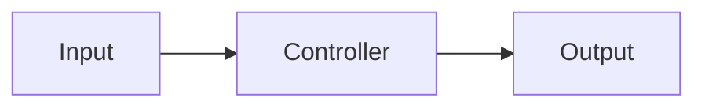

# Opgave 2: Blokdiagram for simpelt system

## Beskrivelse
Lav et blokdiagram der viser systemets hovedkomponenter og dataflow fra opgave 1.
Hold det simpelt: input → controller → output.

## Acceptance criteria
- Diagrammet viser minimum: **input**, **controller**, **output**
- Dataflow/retning er markeret med pile
- Alle blokke har tydelige labels
- Diagrammet kan indgå direkte i teknisk dokumentation (som figur)

## Skabelon

**Eksempel på blokdiagram (tekstbaseret):**

```
[Input] ---> [Controller] ---> [Output]
```

**Eksempel på blokdiagram (mermaid):**



*Du kan tegne diagrammet i hånden og indsætte et billede, eller bruge et værktøj som draw.io, PowerPoint, eller mermaid (se ovenfor).* 

## Referencer
- Introduktion + eksempler på blokdiagrammer
- Teknisk dokumentation: blokdiagram som standard-komponent
- Eksempel på teknisk dokumentation med blokdiagram (LED + ESP32)
