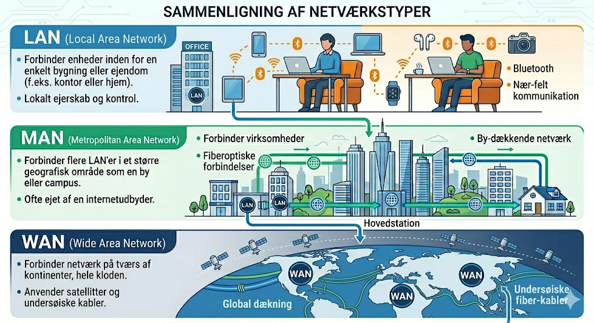
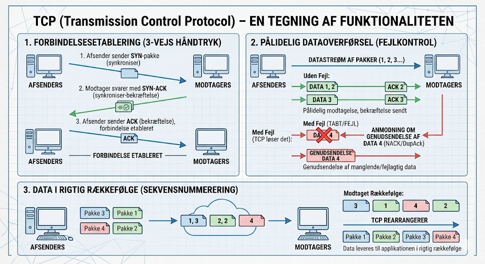

# Hvad er netværk generelt?
Et netværk er en samling af computere, servere, netværksudstyr eller andre enheder, der er forbundet sammen for at dele data og ressourcer. Netværk kan være så små som to computere, der er forbundet sammen, eller så store som internettet, der forbinder millioner af enheder over hele verden.

## Typer af netværk
Der findes flere typer af netværk, herunder:
- **LAN (Local Area Network)**: Et netværk, der dækker et begrænset geografisk område, såsom et hjem, kontor eller skole.
- **WAN (Wide Area Network)**: Et netværk, der dækker et stort geografisk område, såsom internettet.
- **MAN (Metropolitan Area Network)**: Et netværk, der dækker en by eller et større område.

## Netværksprotokoller
Netværksprotokoller er regler og standarder, der styrer, hvordan data overføres og kommunikeres mellem enheder på et netværk. Nogle almindelige netværksprotokoller inkluderer:
- **TCP/IP (Transmission Control Protocol/Internet Protocol)**: Den mest udbredte protokol, der bruges til at forbinde enheder på internettet.

### TCP (Transmission Control Protocol)
TCP er en forbindelsesorienteret protokol, der sikrer pålidelig dataoverførsel mellem enheder på et netværk. Det betyder, at TCP etablerer en forbindelse mellem afsender og modtager, før data sendes, og sørger for, at alle pakker modtages korrekt og i den rigtige rækkefølge.

### IP (Internet Protocol)
IP er ansvarlig for at adressere og dirigere pakker af data, så de kan finde vej fra afsender til modtager over et netværk. IP-adresser bruges til at identificere enheder på et netværk unikt.