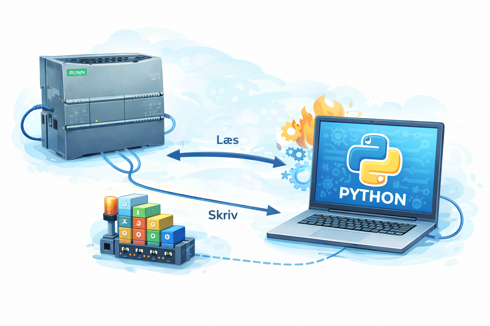
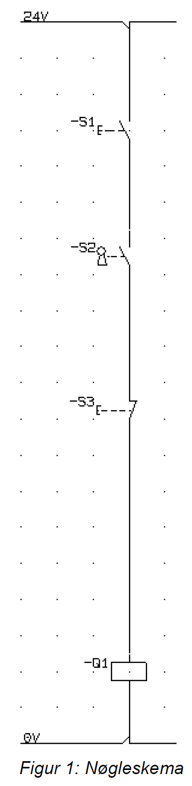

# Opgave: Konvertering af Nøgleskema til Python

## Beskrivelse
I denne opgave skal I programmere logikken fra et traditionelt elektrisk nøgleskema som et Python script, der kommunikerer med PLC'en.
PLC'en styrer et relæ, `Q1`, og har tilkoblet tre fysiske indgange: `S1` (NO), `S2` (NO), og `S3` (NC).

Jeres mål er at etablere kommunikation med PLC'en, aflæse tilstanden på de tre indgange og afgøre – ved hjælp af if/else og logiske operatorer (boolean logic) i Python – om `Q1` skal trække eller ej.

## Hardware og Nøgleskema

  

Udfra diagrammet kan vi se, at kredsløbet består af tre kontakter forbundet i serie frem til relæet `Q1`:
- **-S1**: Normally Open (NO)
- **-S2**: Normally Open (NO) nøgleafbryder
- **-S3**: Normally Closed (NC)

### Sandhedstabel (Fysisk påvirkning)
I tabellen herunder betyder et **1-tal**, at en komponent er fysisk aktiveret (trykket/drejet). Et **0** betyder at den er i hvile.

| S1 (NO) | S2 (NO) | S3 (NC) | Q1 | Beskrivelse |
|:---:|:---:|:---:|:---:|:---|
| 0 | 0 | 0 | 0 | Hvilestatus. S1 og S2 bryder kredsløbet. S3 leder. |
| 1 | 0 | 0 | 0 | Kun S1 aktiveret. S2 afbryder fortsat for strømmen. |
| 0 | 1 | 0 | 0 | Kun S2 aktiveret. S1 er ikke trukket. |
| **1** | **1** | **0** | **1** | **S1 og S2 aktiveret, S3 urørt (leder). Strømmen kan løbe, og Q1 trækker.** |
| 0 | 0 | 1 | 0 | S3 trykket. Kredsløbet brydes helt. |
| 1 | 0 | 1 | 0 | S1 og S3 trykket. S2 er også stadig åben. |
| 0 | 1 | 1 | 0 | S2 og S3 trykket. S1 er stadig åben. |
| 1 | 1 | 1 | 0 | Alle aktiveret, men S3 bryder kredsløbet, og Q1 falder. |

---

## Opgaven
Du skal nu skrive et Python-program, der gør følgende:

1. **Forbind til PLC'en:**
   Sørg for, at dit script kan etablere forbindelse via enten `pycomm3` eller `snap7`, ligesom I lærte tidligere.

2. **Læs inputs i et loop:**
   Aflæs status på `S1`, `S2` og `S3` (True/False) i et kontinuerligt loop (f.eks. et `while True:`-loop evt. med en lille `time.sleep()`).

3. **Implementér logikken (IF / ELSE):**
   Oversæt sandhedstabellen ovenfor til Python-kode ved hjælp af en `if`-konstruktion og de rette logiske operatorer kombineret.
   *Overvej:* Hvilke logiske betingelser skal være opfyldt, for at koden beslutter at `Q1` skal sættes til `True`?

4. **Skriv til Q1:**
   Send det resulterende styresignal tilbage til `Q1` outputs i PLC'en.

