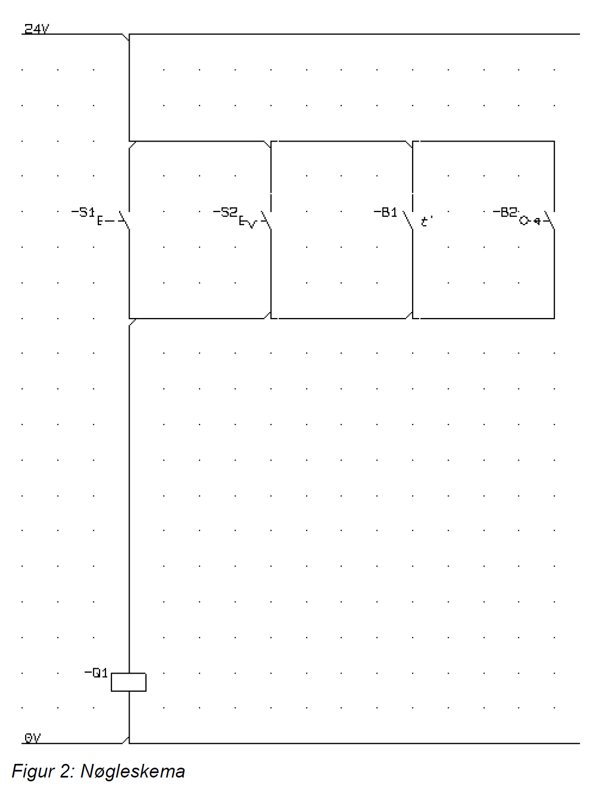

# Opgave: Konvertering af Nøgleskema til Python (Parallelforbindelse)

## Beskrivelse
I denne opgave skal I programmere logikken fra et nyt elektrisk nøgleskema i Python.
PLC'en styrer stadig et relæ, `Q1`, men kredsløbet er nu opbygget med parallelle grene til fire indgange: `S1` (NC), `S2` (NC), `B1` (NC), og `B2` (NC). 

Denne gang skal I oversætte parallelforbindelsen via OR-logik (i stedet for rent serie/AND), og overveje hvad normalt-lukkede indgange betyder for signalet relæet modtager.

## Hardware og Nøgleskema

  

Ud fra diagrammet kan vi se, at kredsløbet består af fire parallelle grene frem til relæet `Q1`:
- **-S1**: Normally Open (NO) trykknap / kontakt
- **-S2**: Normally Open (NO) trykknap / nøgleafbryder
- **-B1**: Normally Open (NO) temperaturføler (eller lign. sensor)
- **-B2**: Normally Open (NO) fotocelle (eller lign. sensor)

Fordi de sidder i parallel, behøver kun *én* af grenene lede strøm for at `Q1` trækker. Da alle fire er NO (Normally Open), leder de *alle* strøm ved aktivering.
For at holde `Q1` deaktiveret (holde den strømløs), skal *samtlige* fire kontakter ikke-aktive samtidig så ingen af deres gren leder strøm.

---

## Opgaven
Du skal nu skrive et Python-program, der gør følgende:

1. **Forbind til PLC'en:**
   Husk din standardopsætning for enten `pycomm3` eller `snap7`.

2. **Læs inputs i et loop:**
   Aflæs tilstandene for `S1`, `S2`, `B1`, og `B2` ind i dit event loop (som bygget tidligere). 
   *OBS:* Husk hvordan PLC'en læser Normally Open (NO) - den læser `False`/`0` elektrisk ind i sine inputs, når knappen påvirkes.

3. **Implementér logikken (IF / ELSE):**
   Du har 4 parallelle signaler. Parallel i diagram = "Eller" / `or` i Python. 
   Opbyg logikken i en `if`-sætning.

4. **Skriv til Q1:**
   Send signalet tilbage til `Q1` outputtet i PLC'en.

### Ekstra udfordring
Gå ind og læs omkring Karnough-kort og boolean simplificering. Kan I forenkle jeres if-sætning ved at bruge de regler, der gælder for logiske udtryk? (Hint: I dette tilfælde er det faktisk ret simpelt, da det er en ren OR-forbindelse).