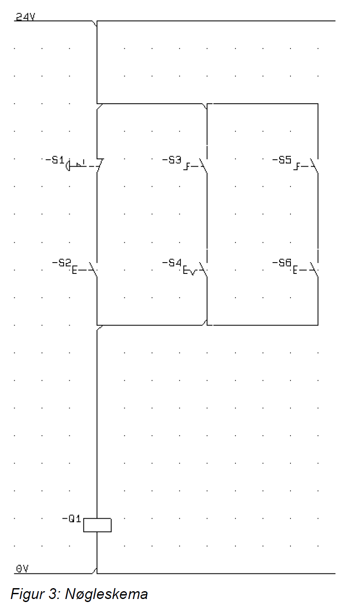

# Opgave: Konvertering af Nøgleskema til Python (Kombineret Serie og Parallel)

## Beskrivelse
I denne opgave bliver kredsløbet mere komplekst. Vi skal programmere logikken fra et elektrisk nøgleskema, som kombinerer både serieforbindelser (AND) og parallelle grene (OR). 
Kredsløbet styrer relæet `Q1`, og der er denne gang hele 6 indgange, du skal forholde dig til: `S1`, `S2`, `S3`, `S4`, `S5` og `S6`.

Jeres mål er at etablere forbindelse, aflæse tilstandene og bruge parenteser i jeres IF-sætninger (Boolean logik) til at adskille de forskellige grene, så `Q1` trækker korrekt.

## Hardware og Nøgleskema

  

Ud fra diagrammet kan vi se tre parallelle grene, der hver består af to komponenter i serie. Strømmen behøver kun at finde vej igennem **én** af grenene for, at `Q1` slutter.

Komponenterne fra venstre mod højre:
**Gren 1:**
- **-S1**: Normally Closed (NC) svampeknap/stopknap
- **-S2**: Normally Open (NO) trykknap

**Gren 2:**
- **-S3**: Normally Open (NO) endestop/rullekontakt
- **-S4**: Normally Open (NO) nøgleafbryder

**Gren 3:**
- **-S5**: Normally Open (NO) endestop/rullekontakt
- **-S6**: Normally Open (NO) trykknap

---

## Opgaven
Skriv et Python-program der gør følgende:

1. **Forbind til PLC'en:**
   Sørg for standardopsætningen via `pycomm3` eller `snap7`.

2. **Læs inputs for alle 6 komponenter:**
   Hent tilstandene fra alle indgange ind i det kontinuerlige main loop. Vær stærk i din navngivning (f.eks. `s1_state`, `s2_state` osv.)

3. **Implementér logikken (IF / ELSE / ELIF):**
   Du har nu 3 parallelle grene (OR logik), der hver kræver 2 betingelser opfyldt samtidig (AND logik). 

4. **Skriv til Q1:**
   Sæt outputtet `Q1` i PLC'en på baggrund af logikken.