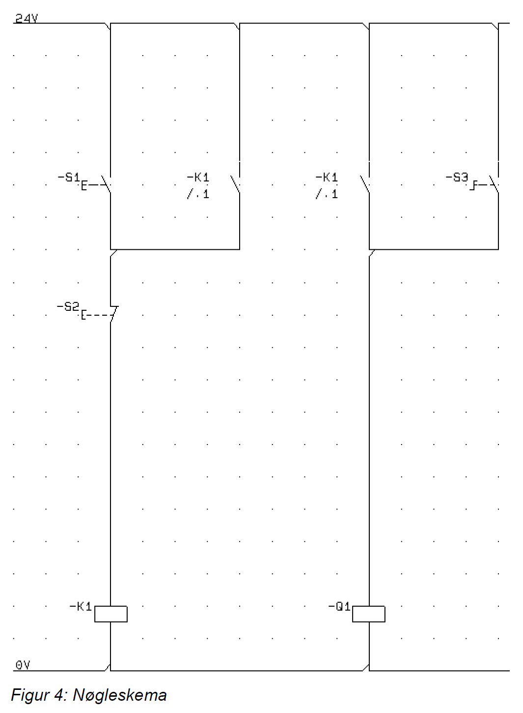

# Opgave: Konvertering af Nøgleskema til Python (Selvhold og Hjælperelæ)

## Beskrivelse
I denne seneste og mest avancerede opgave introduceres et meget almindeligt koncept inden for PLC-styring og traditionel relæteknik: **Selvhold** (på engelsk: *latching* eller *seal-in circuit*).

Kredsløbet indeholder to aktorer, som PLC'en i sidste ende enten skal have internt eller læse/skrive til:
- Et **hjælperelæ / intern variabel (`K1`)**
- Hovedrelæet **`Q1`**

Formålet er, at vi ved et kort tryk på en Start-knap skal kunne lade maskinen køre kontinuerligt, uden at vi behøver at holde knappen inde. Den slukker først, når vi påvirker maskinens Stop-knap.

## Hardware og Nøgleskema
<div align="center">
  
</div>

Af diagrammet kan vi deducere, hvordan selvholdeskredsløbet er bygget op.
- **-S1**: Normally Open (NO) trykknap — fungerer som **Start**.
- **-S3**: Normally Open (NO) trykknap — fungerer som **manual jog**.
- **-S2**: Normally Closed (NC) trykknap — fungerer som **Stop**.
- **-K1 (Relæ)**: Selve relæspolen, der trækker the hjælpestatus.
- **-K1 (Kontakter)**: Der er indsat to styrekontakter drevet af K1. Den ene ligger i parallel henover `S1` (selvholdet), og den er NO, indtil K1 trækker. Den anden føder `Q1`.

**Sådan fungerer maskinen mekanisk / logisk:**
Når `S1` trykkes i et splitsekund, går strømmen igennem til `K1` spolen, da `S2` (NC) i forvejen leder.
Når spolen `K1` trækker, lukker den K1-kontaktsættet som parallel med både `S1`og `S3`. 
Når man så fjerner fingeren fra Start-knappen (`S1`), falder strømmen *ikke* - fordi den nu løber ad parallelstrækningen via `K1` mellemkontakten frem til relæet.
Den anden `K1` kontakt lukker også strømmen ind til et nyt relæ: `Q1` - dette er hovedudgangen. Q1 kan desuden aktiveres rent af `S3`.
Hvis man trykker på Stop-knappen (`S2`), afbrydes the nedre ledning fælles for the selvhold - hjæperelæet falder, maskinen slukkes, the logik nulstilles.

---

## Opgaven
Du skal nu skrive dette "selvhold"-kredsløb som software i Python:

1. **Forbind til PLC'en:**
   Sørg for opsætningen med dine biblioteker.

2. **Læs inputs:**
   I dit `while True:` loop aflæses `S1`, `S2` samt `S3` som før.
   Da der nu opstår en hukommelse i dit system ("kæden kører, fordi den startede for lidt siden"), bliver du sandsynligvis også nødt til at **Aflæse `K1` og `Q1` fra PLC'en**, da de i høj grad vil blive sat af selve Python-scriptet, men skal bruges i logikken næste gang "loopet" ruller!
   
3. **Implementér logikken (Selvhold):**
   Du skal bygge selvholds-regnestykket for `K1`. 
   Den afgørende brik er i "parallelforbindelse" (eller), og den overordnede seriedel (og) – der stopper maskinen.
   Derudover skal du logisk oversætte den anden side af tegningen så `Q1` opfører dig korrekt bestemt ud fra hvad henholdsvis `K1` og `S3` gør i deres gren.

4. **Skriv til K1 og Q1:**
   Sæt begge outputs, `K1` og `Q1` højet i PLC'en, så de afspejler den korrekte logik.

### 💡 Tips & Faldgruber til Selvhold (Latching Logic)
Når vi omformer en selvholdskreds til en booleansk streng (`if.../else / variable=...` ), kan den laves på flere måder og her er to måder at tænke på det:
- Ukompakt:
```python
if S1 or K1:
    K1 = True
else:
    K1 = False

if K1 or S3:
    Q1 = True
else:
    Q1 = False
```
- Kompakt:
```python
K1 = (S1 or K1) and not(S2)
Q1 = K1 or S3
```