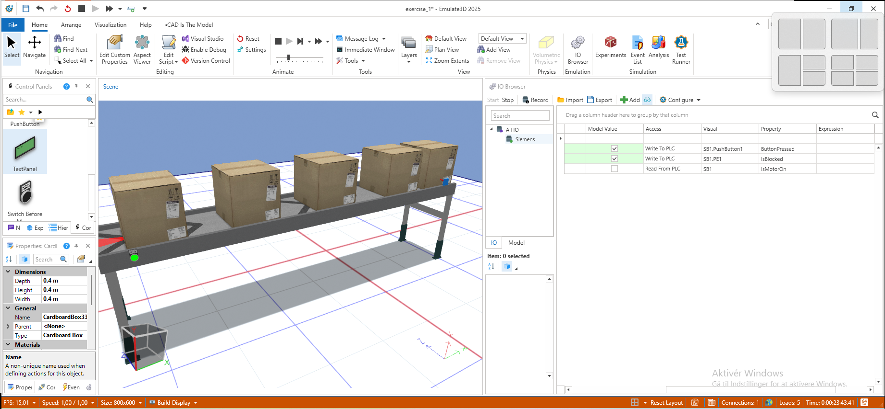

# Etablere forbindelse mellem Emulate3d og simulering
I denne opgave skal du etablere en forbindelse mellem Emulate3D og din PLC-simulering, så du kan aflæse og styre inputs/outputs i realtid. 

Der er to typer af simulering du kan bruge:
- **PLCSIM adv.**
- **Snap7 Server**

Det er helt op til jer at vælge hvilken metode I vil bruge. PLCSIM adv. kender i men trækker flere ressourcer, mens Snap7 leight weight. 

## Opgaven
Du skal etablere en forbindelse mellem Emulate3D og din PLC-simulering, så du kan aflæse og styre inputs/outputs i realtid.

Opgaven er fuldført når du kan se den grønne "Connected" IO Browser i Emulate3D, og når du kan aflæse og styre inputs/outputs i realtid.

