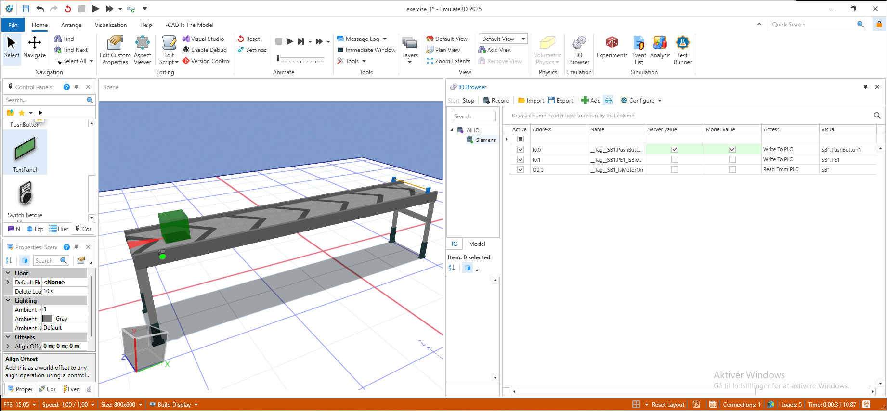

# Simpel transportbåndsstyring

I dette eksempel skal vi lave en simpel transportbåndsstyring, hvor et transportbånd starter når en knap (S1) er trykket, og stopper når fotocellen (S2) registrerer et objekt. Vi vil bruge en simpel IF/ELSE logik til at styre en udgang (Q1).

## Funktionsbeskrivelse

Transportbåndet styres af to sensorer:
- **S1 (knap):** Starter transportbåndet, når den trykkes.
- **S2 (fotocelle):** Stopper transportbåndet, når et objekt registreres.

Systemet fungerer således:
- Når S1 aktiveres, sættes udgangen Q1, så transportbåndet starter.
- Når S2 registrerer et objekt, slukkes Q1, og transportbåndet stopper.
- Hvis S1 trykkes igen, starter transportbåndet på ny.

Logikken implementeres med en simpel IF/ELSE-struktur, hvor udgangen Q1 styres direkte af input fra S1 og S2.

Udvid gerne logikken, så den også inkluderer en stop-knap (S3), som kan stoppe transportbåndet uanset hvad.