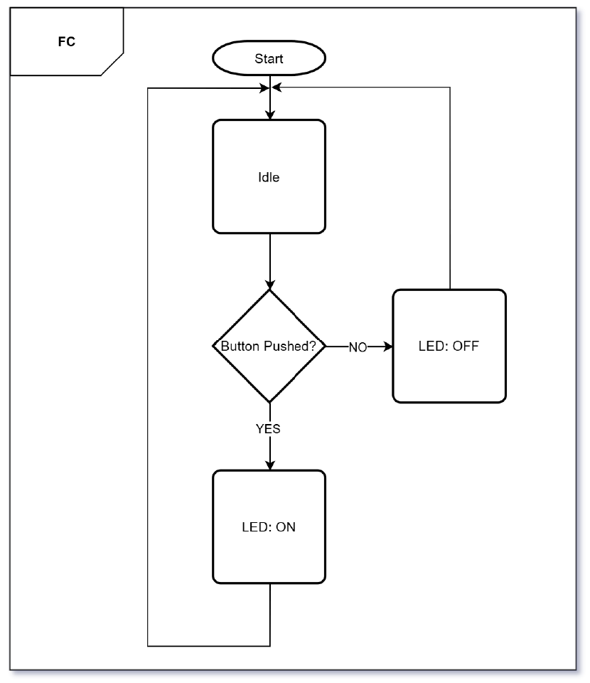

# Opgave 3: Flowchart for programlogik

## Beskrivelse
Lav et flowchart der beskriver logikken (fx “Button pushed?” → LED ON/OFF).
Brug standard-elementer: Start/Stop, Process, Decision.

## Acceptance criteria
- Flowchart har Start og Stop (eller tydeligt loop for embedded)
- Indeholder mindst én **Decision** (fx knap trykket? temperatur > 25°C?)
- Flowet er logisk uden “døde ender”
- Diagrammet kan bruges som bilag/figur i dokumentation

## Skabelon

**Eksempel på flowchart (tekstbaseret):**

```
[Start]
  |
[Er knap trykket?] -- Nej --> [Stop]
  |
 Ja
  |
[LED ON]
  |
[Stop]
```

**Eksempel**


*Du kan tegne diagrammet i hånden og indsætte et billede, eller bruge et værktøj som draw.io, PowerPoint, eller mermaid (se ovenfor).* 

## Referencer
- Flowchart basics + faldgruber
- Teknisk dokumentation: flowchart som typisk element
- Eksempel på teknisk dokumentation hvor flowchart indgår
