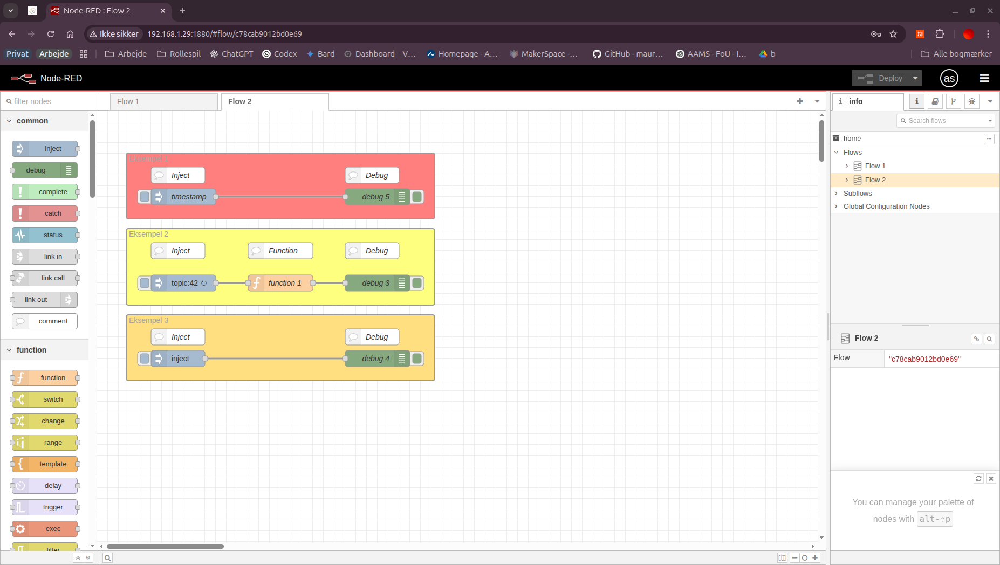
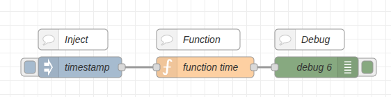
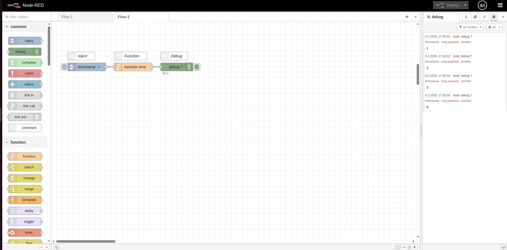

# 💉 Inject Node

Inject-noden er et af de grundlæggende udgangspunkter for Node-RED flows. Den gør det muligt at manuelt eller automatisk trigge flows ved at sende specificerede beskeder ind i flowet.

## 🎯 Formål

I denne guide lærer du om inject-noden og dens anvendelse til at:
- Starte flows manuelt 
- Sende forskellige datatyper ind i et flow
- Konfigurere periodiske eller planlagte triggers

---

## ⚡ Grundfunktionalitet

Inject-noden kan indsprøjte forskellige typer af data i dit flow:

- **Timestamps**: Dato og klokkeslæt for aktivering
- **Strenge**: Foruddefinerede tekstværdier
- **Tal**: Numeriske værdier
- **Boolske værdier**: true/false
- **JSON objekter**: Strukturerede data
- **Buffer**: Binære data
- **Miljøvariabler**: Værdier fra Node-RED's miljø

Du kan aktivere inject-noden på tre måder:
1. **Manuelt**: Ved at klikke på knappen på selve noden
2. **Periodisk**: Gentag med et fast interval
3. **Planlagt**: På specifikke tidspunkter ved hjælp af cron-udtryk

---

## 🛠️ Konfiguration

### Payload-typer


- **Timestamp**: Indsætter nuværende dato/tid
- **String**: Tekstværdi (fx "Hello World")
- **Number**: Numerisk værdi (fx 42)
- **Boolean**: true eller false
- **JSON**: Strukturerede data i JSON-format
- **Buffer**: Binært indhold
- **Flow/Global Variable**: Henter værdi fra flow/global context

### Gentag-indstillinger

Du kan konfigurere inject-noden til at aktivere periodisk:

- **None**: Kun manuel aktivering
- **Interval**: Hvert n sekunder/minutter/timer
- **At specific time(s)**: På specifikke tidspunkter med cron-udtryk
- **After startup delay**: n sekunder efter Node-RED opstart

---

## 💡 Eksempler

### Eksempel 1: Basalt timestamp flow

```
[Inject] → [Debug]
```

Konfiguration:
- Payload: timestamp
- Topic: "timestamp"

Dette vil vise det aktuelle tidspunkt i debug-panelet, når du klikker på inject-knappen.

### Eksempel 2: Periodisk numerisk værdi

```
[Inject] → [Function] → [Debug]
```

Konfiguration:
- Payload: number (42)
- Topic: "counter"
- Repeat: interval (hvert 5. sekund)

Function-node:
```javascript
// Tilføj 1 til værdien hver gang
msg.payload = msg.payload + 1;
return msg;
```

Dette vil sende tallet 42, 43, 44, osv. til debug-panelet hvert 5. sekund.


### Eksempel 3: JSON objekt

```
[Inject] → [Debug]
```

Konfiguration:
- Payload: JSON
- Værdi: `{"sensorId": "temp1", "value": 22.5, "unit": "C"}`

Dette vil sende et JSON-objekt der repræsenterer en sensoraflæsning.

---



---

## 🔄 Avanceret: Multiple Payloads

Du kan også konfigurere inject-noden til at indstille flere egenskaber i en enkelt besked:

1. Indstil først standard payload
2. Klik på "Add property" knappen
3. Angiv egenskabsnavn (f.eks. "topic") og værdi

For eksempel:
- Payload: number (42)
- Property: topic = "temperature"
- Property: unit = "celsius"

Dette vil sende en besked med disse tre egenskaber på én gang.

---

## ⚠️ Begrænsninger

- Inject-noden kan kun starte flows, ikke modtage data fra andre noder
- Cron-planlagte injections kører måske ikke præcis på millisekundet
- Meget hyppige injections (< 100ms) kan påvirke Node-RED's ydeevne

---

## 🏋️ Øvelser (begynder)

Start med et tomt flow i Node-RED. Efter hver øvelse: klik Deploy og tryk på inject-knappen for at se resultatet i Debug-panelet.

### Øvelse 1: Timestamp til læselig tid

**Hvad du lærer:** Inject med timestamp og formatering i en function-node.

**Trin:**

1. Træk en **Inject-node** ind på dit flow og dobbeltklik på den
2. Sæt Payload til `timestamp` (det er standard, så det er nok allerede valgt)
3. Klik Done
4. Træk en **Debug-node** ind
5. Forbind Inject → Debug (træk fra prikken på højre side af Inject til venstre side af Debug)
6. Træk nu en **Function-node** ind *mellem* de to noder
7. Dobbeltklik på Function-noden og indsæt denne kode:
   ```javascript
   // Formater tidsstempel til lokal tid
   var date = new Date(msg.payload);
   msg.payload = date.toLocaleTimeString();
   return msg;
   ```
8. Klik Done
9. Klik på den røde **Deploy**-knap øverst til højre
10. Klik på knappen til venstre for Inject-noden
11. Åbn Debug-panelet til højre og se et klokkeslæt som fx `14:23:05`



---

### Øvelse 2: Simpel tæller hvert 2. sekund

**Hvad du lærer:** Gem og opdater tal i node-context, så værdier huskes mellem kørsler.

**Trin:**

1. Træk en **Inject-node** ind og dobbeltklik på den
2. Sæt disse indstillinger:
   - Payload: Vælg `number` og skriv `0`
   - Repeat: Vælg `interval` og sæt den til `2` sekunder
3. Klik Done
4. Træk en **Function-node** ind og dobbeltklik på den
5. Indsæt denne kode:
   ```javascript
   // Tæl op for hver injektion
   var count = context.get('count') || 0;
   count++;
   context.set('count', count);
   msg.payload = count;
   return msg;
   ```
6. Klik Done
7. Træk en **Debug-node** ind
8. Forbind: Inject → Function → Debug
9. Klik **Deploy**
10. Se Debug-panelet tælle: 1, 2, 3, 4, ... hvert 2. sekund

**Stop tælleren:** Dobbeltklik på Inject-noden, sæt Repeat til `none` og Deploy igen.



---

### Øvelse 3: Periodisk beskedgenerator

**Hvad du lærer:** Send beskeder med topic og string payload i interval.

**Trin:**

1. Træk en **Inject-node** ind og dobbeltklik på den
2. Sæt disse indstillinger:
   - Payload: Vælg `string` og skriv `Systemet kører som det skal`
   - Topic: Skriv `status_check`
   - Repeat: Vælg `interval` og sæt til `10` sekunder
3. Klik Done
4. Træk en **Debug-node** ind
5. Forbind Inject → Debug
6. Klik **Deploy**
7. Vent 10 sekunder eller klik manuelt på Inject-knappen
8. Se i Debug-panelet at både topic og payload vises

**Forventet i Debug:**
```
status_check : msg.payload : string[27]
"Systemet kører som det skal"
```

**Ekstra:** Stop inject'en ved at dobbeltklik på noden, sæt Repeat til `none` og Deploy igen.

---

### 💡 Bonus: Planlagt daglig kørsel

Vil du køre noget hver dag kl. 08:00? Brug disse indstillinger i Inject-noden:

1. Dobbeltklik på Inject-noden
2. Under "Repeat": Vælg `at a specific time`
3. Vælg klokkeslæt `08:00:00` i dropdown-menuen
4. Vælg hvilke dage (standard er alle dage)
5. Klik Done og Deploy

Nu vil noden automatisk køre hver morgen kl. 08:00.

---

## 🔍 Yderligere ressourcer

- [Node-RED Documentation - Inject Node](https://nodered.org/docs/user-guide/nodes#inject)
- [Advanced scheduling with Cron syntax](https://crontab.guru/)
- [Working with different data types in Node-RED](https://nodered.org/docs/user-guide/messages)
