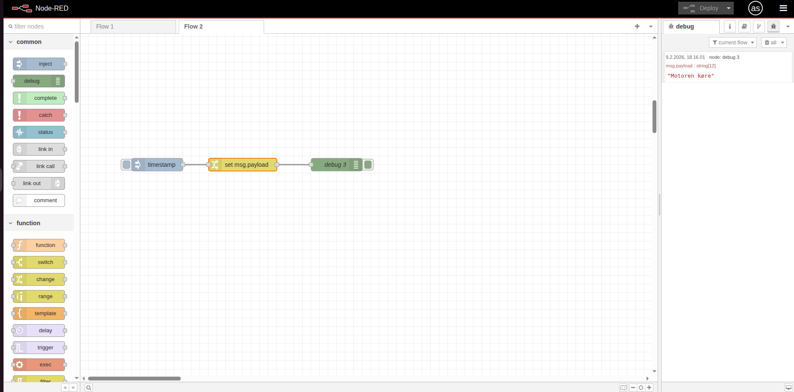
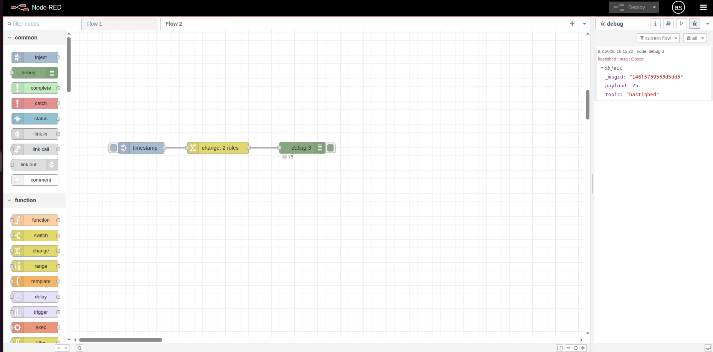
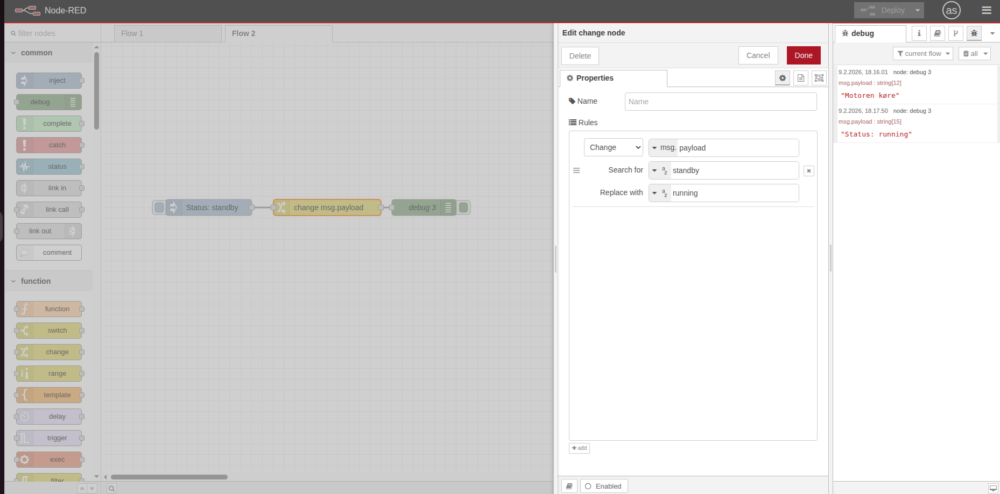

# 🔄 Change Node

Change-noden lader dig ændre beskeder uden at skrive kode. Den er perfekt til at ændre payload, tilføje egenskaber eller finde-og-erstatte i tekst.

## 🎯 Formål

Med change-noden kan du:
- Ændre payload til en ny værdi
- Tilføje eller slette egenskaber i en besked
- Finde og erstatte tekst

---

## ⚡ Fire grundlæggende operationer

1. **Set** - Sæt en værdi (fx `msg.payload = "Hello"`)
2. **Change** - Find og erstat tekst (fx `"lav"` → `"høj"`)
3. **Move** - Flyt en værdi til et nyt sted
4. **Delete** - Fjern en egenskab

Du kan tilføje flere operationer i samme node - de køres fra top til bund.

---

## 💡 Eksempler

### Eksempel 1: Ændre payload

```
[Inject] → [Change] → [Debug]
```

Change-node:
- Action: **Set** `msg.payload` til string `"Hello World"`

Resultatet bliver altid `"Hello World"` uanset hvad inject sender.

### Eksempel 2: Tilføj topic

```
[Inject] → [Change] → [Debug]
```

Change-node:
- Action 1: **Set** `msg.topic` til string `"greeting"`
- Action 2: **Set** `msg.payload` til string `"Hello"`

Nu har beskeden både payload og topic.

---

## 🏋️ Øvelser (begynder)

### Øvelse 1: Ændre payload til tekst

1. Træk **Inject** → **Change** → **Debug** ind
2. Dobbeltklik på Change-noden:
   - Action: **Set** (standard)
   - Property: `msg.payload`
   - To: `string` → skriv `Motoren kører`
3. Deploy og test med Inject-knappen

**Du skal se:** `"Motoren kører"` i Debug-panelet



---

### Øvelse 2: Tilføj topic til beskeden

1. Træk **Inject** → **Change** → **Debug** ind
2. I Inject: Sæt payload til number `75`
3. I Change-noden:
   - Klik **+ add** for at tilføje en regel
   - Action: **Set**
   - Property: `msg.topic`
   - To: `string` → skriv `hastighed`
4. I Debug: Vælg `complete msg object`
5. Deploy og test

**Du skal se:**
```
payload: 75
topic: "hastighed"
```



---

### Øvelse 3: Find og erstat tekst

1. Træk **Inject** → **Change** → **Debug** ind
2. I Inject: Sæt payload til string `Status: standby`
3. I Change-noden:
   - Action: **Change** (ikke Set!)
   - Property: `msg.payload`
   - Search for: `standby`
   - Replace with: `running`
4. Deploy og test

**Du skal se:** `"Status: running"`



---

## 🔍 Yderligere ressourcer

- [Node-RED Documentation - Change Node](https://nodered.org/docs/user-guide/nodes#change)
