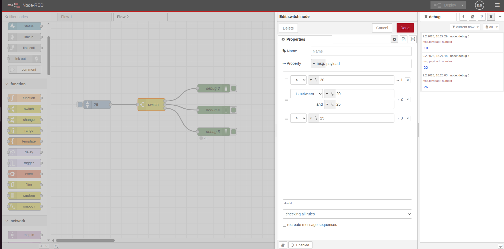
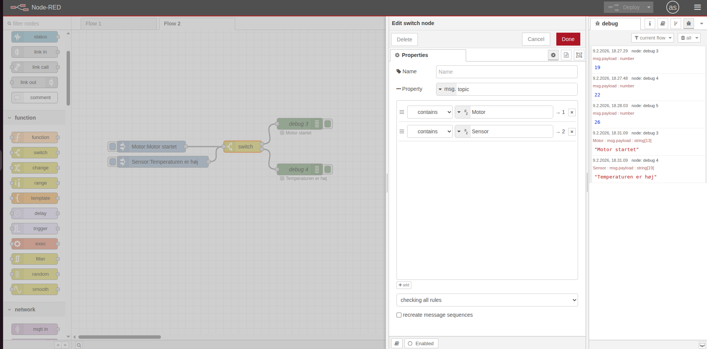
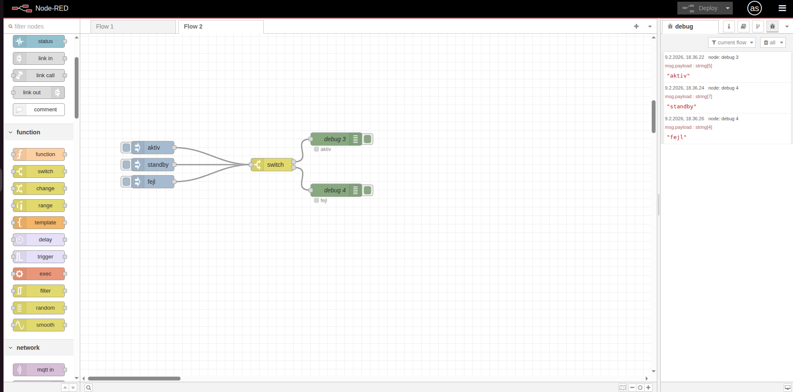

# 🔀 Switch Node

Switch-noden router beskeder til forskellige outputs baseret på simple betingelser. Tænk på det som en "hvis-så" funktion uden at skrive kode.

## 🎯 Formål

Med switch-noden kan du:
- Route beskeder til forskellige outputs baseret på værdier
- Filtrere beskeder (fx kun høje temperaturer videre)
- Opdele et flow i flere grene

---

## ⚡ Hvordan det virker

Switch-noden tjekker en værdi (fx `msg.payload`) og sammenligner den med dine regler:

- **Regel 1 match?** → Send til output 1
- **Regel 2 match?** → Send til output 2
- **Ingen match?** → Beskeden stoppes (medmindre du har en "otherwise" regel)

Du kan vælge:
- **Stop efter første match** (standard)
- **Send til alle matchende outputs**

---

## 💡 Eksempler

### Eksempel 1: Temperaturvarsling

```
[Inject] → [Switch] → [Debug "Koldt", Debug "OK", Debug "Varmt"]
```

Switch-node:
- Egenskab: `msg.payload`
- Regel 1: `< 18` → output 1 (koldt)
- Regel 2: `is between 18 and 25` → output 2 (OK)
- Regel 3: `> 25` → output 3 (varmt)

### Eksempel 2: Filtrer fejlbeskeder

```
[Inject] → [Switch] → [Debug "OK", Debug "Fejl"]
```

Switch-node:
- Egenskab: `msg.topic`
- Regel 1: `== "status/ok"` → output 1
- Regel 2: `contains "error"` → output 2

---

## 🏋️ Øvelser (begynder)

### Øvelse 1: Simpel temperaturrouting

1. Træk **Inject** → **Switch** → **Debug** ind
2. I Inject: Sæt payload til number `30`
3. I Switch-noden:
   - Property: `msg.payload` (standard)
   - Klik **+ add** to gange for at få 3 regler:
   - Regel 1: Vælg `<` og skriv `20` (mindre end 20)
   - Regel 2: Vælg `is between` og skriv `20` and `25` (mellem 20 og 25)
   - Regel 3: Vælg `>` og skriv `25` (større end 25)
4. Træk 3 **Debug-noder** ind
5. Forbind hver output til sin Debug (output 1→Debug 1, osv.)
6. Giv Debug-noderne navne: "Koldt", "Normalt", "Varmt"
7. Deploy og test med forskellige værdier (fx 19, 22, 26)

**Du skal se:** Kun "Varmt" viser beskeden når payload er 26.



---

### Øvelse 2: Filtrer på topic

1. Træk **Inject** → **Switch** → **Debug** ind
2. Opret 2 Inject-noder med forskellige topics:
   - Inject 1: payload=`"Motor startet"`, topic=`"motor"`
   - Inject 2: payload=`"Temperatur høj"`, topic=`"sensor"`
3. I Switch-noden:
   - Property: `msg.topic`
   - Regel 1: `contains` `"motor"`
   - Regel 2: `contains` `"sensor"`
4. Forbind begge Inject → Switch
5. Forbind 2 Debug-noder til output 1 og 2
6. Navngiv Debug: "Motor beskeder", "Sensor beskeder"
7. Deploy og test begge inject-knapper

**Du skal se:** Beskederne bliver sendt til forskellige Debug-noder baseret på topic.



---

### Øvelse 3: Otherwise (catch-all)

1. Træk **Inject** → **Switch** → **Debug** ind
2. I Inject: Sæt payload til string `"aktiv"`
3. I Switch-noden:
   - Property: `msg.payload`
   - Regel 1: `==` `"aktiv"`
   - Regel 2: Vælg **otherwise** fra dropdown (nederst)
4. Forbind 2 Debug-noder
5. Deploy og test med forskellige værdier: `"aktiv"`, `"standby"`, `"fejl"`

**Du skal se:** "aktiv" går til output 1, alt andet går til output 2.



---

## 🔍 Yderligere ressourcer

- [Node-RED Documentation - Switch Node](https://nodered.org/docs/user-guide/nodes#switch)
