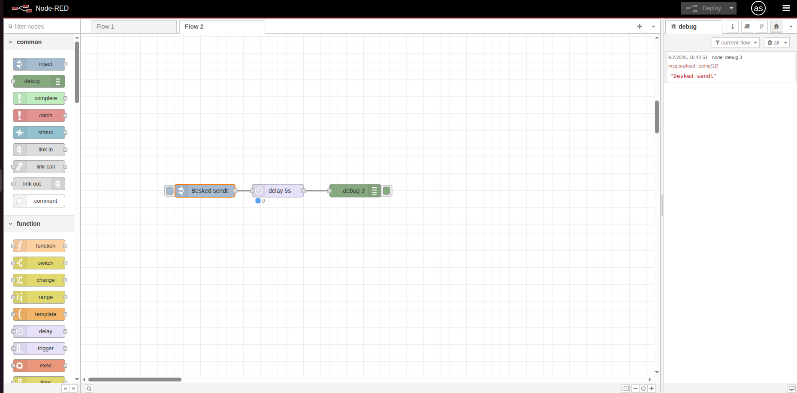
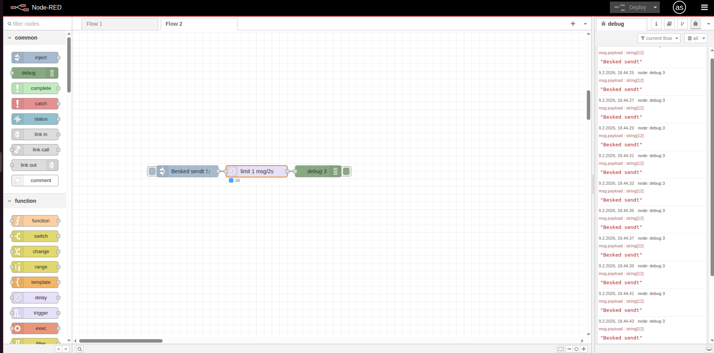

# ⏱️ Delay Node

Delay-noden lader dig forsinke beskeder eller begrænse hvor mange beskeder der sendes videre pr. sekund. Nyttig til at undgå at overbelaste systemer.

## 🎯 Formål

Med delay-noden kan du:
- Forsinke en besked med et antal sekunder
- Begrænse antallet af beskeder der sendes videre (rate limiting)
- Undgå at overbelaste andre systemer (fx databaser, API'er)

---

## ⚡ To hovedfunktioner

1. **Delay each message** - Forsinker hver besked med et fast antal sekunder
2. **Limit rate to** - Sender højst X beskeder pr. sekund/minut

**Eksempel:**
- Delay: Vent 2 sekunder før beskeden sendes videre
- Rate limit: Send max 1 besked pr. sekund (resten venter i kø)

---

## 💡 Eksempler

### Eksempel 1: Forsink besked 3 sekunder

```
[Inject] → [Delay] → [Debug]
```

Delay-node:
- Action: "Delay each message"
- For: "3 seconds"

Beskeden venter 3 sekunder før den vises i Debug.

### Eksempel 2: Begræns til 1 besked pr. sekund

```
[Inject] → [Delay] → [Debug]
```

Delay-node:
- Action: "Limit rate to"
- To: "1 message per 1 second"
- Med "all messages" valgt

Selv hvis du klikker Inject mange gange hurtigt, sendes kun 1 besked pr. sekund videre.

---

## 🏋️ Øvelser (begynder)

### Øvelse 1: Forsink en besked

1. Træk **Inject** → **Delay** → **Debug** ind
2. I Inject: Sæt payload til string `"Besked sendt"`
3. I Delay-noden:
   - Action: **Delay each message**
   - For: `5` seconds
4. Deploy og klik på Inject-knappen
5. Observer at Debug først viser beskeden efter 5 sekunder

**Du skal se:** Beskeden kommer først efter et mellemrum på 5 sekunder.



---

### Øvelse 2: Rate limit - begræns hastigheden

1. Træk **Inject** → **Delay** → **Debug** ind
2. I Inject: Sæt repeat til `interval` hver `0.5` sekunder (det er hver halve sekund)
3. I Delay-noden:
   - Action: **Limit rate to**
   - To: `1` message per `2` seconds
   - Vælg "all messages" (så de køes)
4. Deploy og vent 10 sekunder
5. Stop inject'en igen (sæt repeat til none og deploy)

**Du skal se:** Selvom inject sender hver 0.5 sekund, viser Debug kun én besked hvert 2. sekund. De andre venter i kø.



---

## 🔍 Yderligere ressourcer

- [Node-RED Documentation - Delay Node](https://nodered.org/docs/user-guide/nodes#delay)
