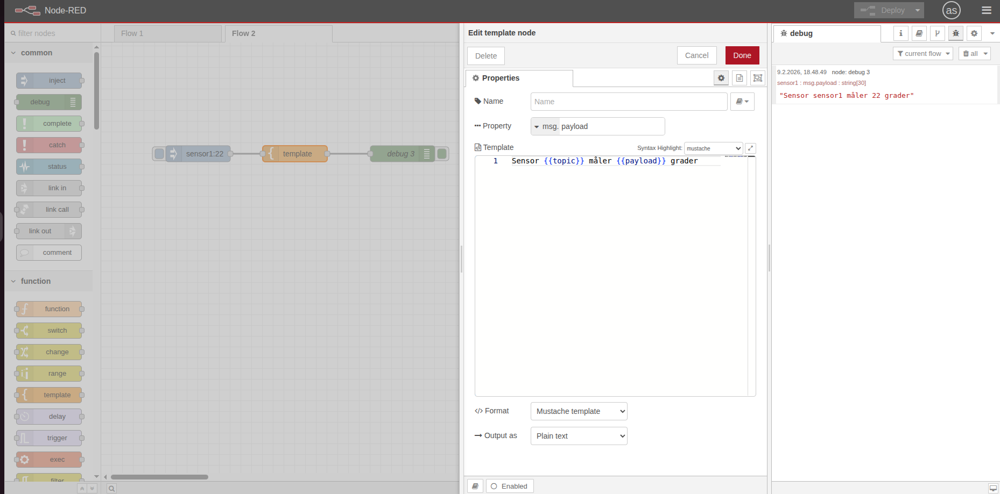
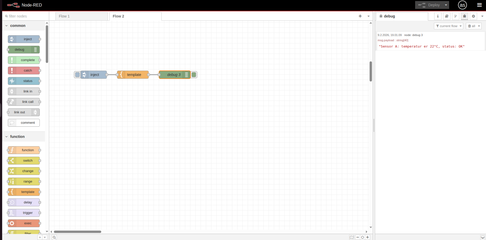
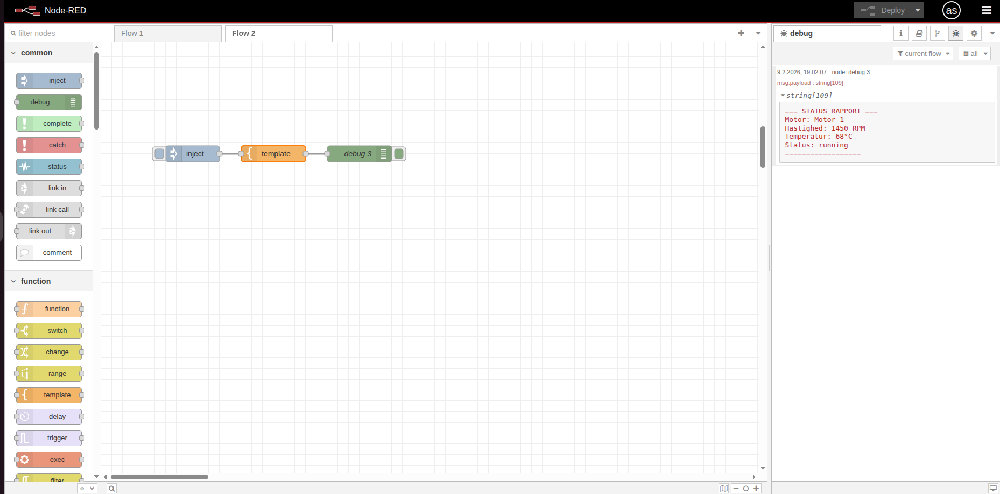

# 📝 Template Node

Template-noden lader dig lave tekst med pladsholdere der automatisk bliver erstattet med værdier fra beskeder. Perfekt til at lave beskeder, HTML eller JSON.

## 🎯 Formål

Med template-noden kan du:
- Lave dynamisk tekst med værdier fra beskeder
- Bygge HTML-sider med data
- Formatere beskeder pænt

---

## ⚡ Mustache-syntaks

Template-noden bruger **Mustache** til at indsætte værdier:

- `{{payload}}` - Indsætter værdien fra `msg.payload`
- `{{topic}}` - Indsætter værdien fra `msg.topic`
- `{{payload.temperature}}` - Indsætter værdi fra et objekt

**Eksempel:**
```
Temperaturen er {{payload}}°C
```
Hvis `msg.payload = 22`, bliver resultatet: `Temperaturen er 22°C`

---

## 💡 Eksempler

### Eksempel 1: Simpel tekstbesked

```
[Inject] → [Template] → [Debug]
```

Inject: Sæt payload til `22` og topic til `"sensor1"`

Template:
```
Sensor {{topic}} måler {{payload}} grader
```

**Resultat:** `"Sensor sensor1 måler 22 grader"`



### Eksempel 2: Byg en besked fra et objekt

```
[Inject] → [Template] → [Debug]
```

Inject: Sæt payload til et objekt:
```json
{
  "temp": 21,
  "humidity": 55
}
```

Template:
```
Temperatur: {{payload.temp}}°C, Luftfugtighed: {{payload.humidity}}%
```

**Resultat:** `"Temperatur: 21°C, Luftfugtighed: 55%"`

---

## 🏋️ Øvelser (begynder)

### Øvelse 1: Byg en statusbesked

1. Træk **Inject** → **Template** → **Debug** ind
2. I Inject: Sæt payload til number `75` og topic til `"motor_hastighed"`
3. I Template-noden:
   - Skriv i template-feltet:
   ```
   Status: {{topic}} er {{payload}} RPM
   ```
4. Deploy og test

**Du skal se:** `"Status: motor_hastighed er 75 RPM"`


---

### Øvelse 2: Brug et objekt

1. Træk **Inject** → **Template** → **Debug** ind
2. I Inject: Sæt payload til JSON:
   ```json
   {
     "navn": "Sensor A",
     "temp": 22,
     "status": "OK"
   }
   ```
3. I Template-noden:
   ```
   {{payload.navn}}: temperatur er {{payload.temp}}°C, status: {{payload.status}}
   ```
4. Deploy og test

**Du skal se:** `"Sensor A: temperatur er 22°C, status: OK"`



---

### Øvelse 3: Formateret statusrapport

1. Træk **Inject** → **Template** → **Debug** ind
2. I Inject: Sæt payload til et objekt:
   ```json
   {
     "motor": "Motor 1",
     "rpm": 1450,
     "temp": 68,
     "status": "running"
   }
   ```
3. I Template-noden:
   ```
   === STATUS RAPPORT ===
   Motor: {{payload.motor}}
   Hastighed: {{payload.rpm}} RPM
   Temperatur: {{payload.temp}}°C
   Status: {{payload.status}}
   ==================
   ```
4. Deploy og test

**Du skal se:** En pænt formateret statusrapport i Debug-panelet.



---

## 🔍 Yderligere ressourcer

- [Node-RED Documentation - Template Node](https://nodered.org/docs/user-guide/nodes#template)
- [Mustache Template System](https://mustache.github.io/)

