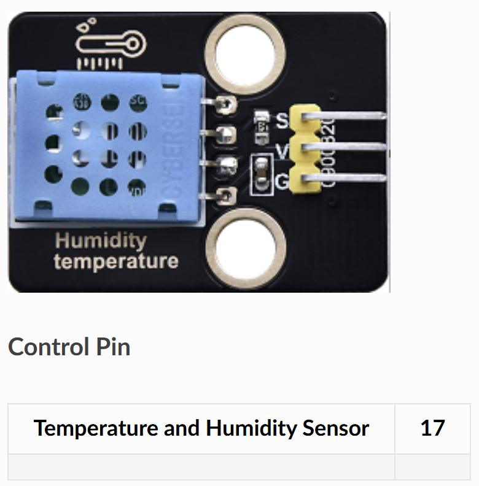

# 🌡️ Opgave 01 – Publish DHT11 Data med ESP32

I denne opgave skal du programmere ESP32 til at læse data fra en DHT11 temperatursensor og sende det via MQTT til en broker.



## 🎯 Formål

Lær at:
- Læse temperatur og fugtighed fra DHT11
- Forbinde til WiFi fra ESP32
- Sende sensordata via MQTT til `test.mosquitto.org`

---

## 💡 Python-kode

Opret en ny fil i Thonny og skriv følgende:

```python
# ESP32 + DHT11 MQTT Publisher
# Læser temperatur og fugtighed og sender via MQTT

import machine
import dht
import time
import network
from umqtt.simple import MQTTClient

# ===== KONFIGURATION - REDIGER DISSE VÆRDIER =====
WIFI_SSID = "DIT_WIFI_NAVN"
WIFI_PASSWORD = "DIT_WIFI_PASSWORD"

MQTT_BROKER = "test.mosquitto.org"  # Eller din egen broker
MQTT_PORT = 1883
MQTT_TOPIC_TEMP = "stud/esp32/dit_navn/temperature"
MQTT_TOPIC_HUM = "stud/esp32/dit_navn/humidity"
MQTT_CLIENT_ID = "esp32_dit_navn"

DHT_PIN = 4  # GPIO 4
SEND_INTERVAL = 5  # Send data hvert 5. sekund
# ==================================================

# Opsæt DHT11 sensor
sensor = dht.DHT11(machine.Pin(DHT_PIN))

# Forbind til WiFi
def connect_wifi():
    wlan = network.WLAN(network.STA_IF)
    wlan.active(True)
    if not wlan.isconnected():
        print('Forbinder til WiFi...')
        wlan.connect(WIFI_SSID, WIFI_PASSWORD)
        while not wlan.isconnected():
            time.sleep(1)
    print('WiFi forbundet!')
    print('IP-adresse:', wlan.ifconfig()[0])

# Forbind til MQTT broker
def connect_mqtt():
    client = MQTTClient(MQTT_CLIENT_ID, MQTT_BROKER, port=MQTT_PORT)
    client.connect()
    print('MQTT forbundet til:', MQTT_BROKER)
    return client

# Læs sensor og send data
def read_and_publish(client):
    try:
        sensor.measure()  # Trigger måling
        temp = sensor.temperature()
        hum = sensor.humidity()
        
        print(f'Temperatur: {temp}°C, Fugtighed: {hum}%')
        
        # Send data til MQTT
        client.publish(MQTT_TOPIC_TEMP, str(temp))
        client.publish(MQTT_TOPIC_HUM, str(hum))
        print('Data sendt til MQTT!')
        
    except OSError as e:
        print('Fejl ved læsning af sensor:', e)

# Hovedprogram
def main():
    connect_wifi()
    client = connect_mqtt()
    
    print('Starter sensor-loop...')
    while True:
        read_and_publish(client)
        time.sleep(SEND_INTERVAL)

# Start programmet
main()
```

### Konfigurér og kør

1. **Rediger følgende i koden:**
   - `WIFI_SSID` → Dit WiFi-navn
   - `WIFI_PASSWORD` → Dit WiFi-password
   - `dit_navn` i topics → Dit eget navn (fx `stud/esp32/anders/temperature`)
   - `MQTT_CLIENT_ID` → Unikt ID (fx `esp32_anders`)

2. **Gem filen:**
   - **File → Save as → MicroPython device**
   - Gem som `main.py`

3. **Kør programmet:**
   - Tryk **F5**
   - Se output i Shell-vinduet

**Forventet output:**
```
Forbinder til WiFi...
WiFi forbundet!
IP-adresse: 192.168.1.123
MQTT forbundet til: test.mosquitto.org
Starter sensor-loop...
Temperatur: 22°C, Fugtighed: 65%
Data sendt til MQTT!
```

✅ Din ESP32 sender nu DHT11-data via MQTT hvert 5. sekund!