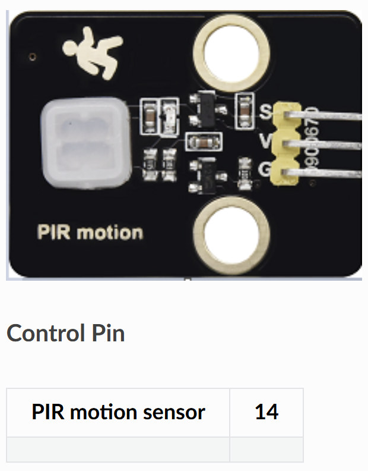

# 🚶 Opgave 02 – Publish PIR Bevægelsesdata med ESP32

I denne opgave skal du programmere ESP32 til at læse data fra en PIR bevægelsessensor og sende det via MQTT til en broker når der registreres bevægelse.



## 🎯 Formål

Lær at:
- Læse digital input fra PIR sensor
- Forbinde til WiFi fra ESP32
- Sende bevægelsesdata via MQTT når tilstanden ændrer sig

---

## 💡 Python-kode

Opret en ny fil i Thonny og skriv følgende:

```python
# ESP32 + PIR Bevægelsessensor MQTT Publisher
# Sender "1" ved bevægelse, "0" ved ingen bevægelse

import time
import network
from machine import Pin, unique_id
import ubinascii
from umqtt.simple import MQTTClient

# ===== KONFIGURATION - REDIGER DISSE VÆRDIER =====
WIFI_SSID = "DIT_WIFI_NAVN"
WIFI_PASSWORD = "DIT_WIFI_PASSWORD"

MQTT_BROKER = "test.mosquitto.org"  # Eller din egen broker
MQTT_TOPIC = b"stud/esp32/dit_navn/motion"

PIR_PIN = 14  # GPIO 14 til PIR sensor
# ==================================================

# Forbind til WiFi
def wifi_connect(ssid, password):
    wlan = network.WLAN(network.STA_IF)
    wlan.active(True)
    if not wlan.isconnected():
        print('Forbinder til WiFi...')
        wlan.connect(ssid, password)
        while not wlan.isconnected():
            time.sleep(0.3)
    print('WiFi forbundet!')
    print('IP-adresse:', wlan.ifconfig()[0])
    return wlan

# Opret MQTT klient med unikt ID
def mqtt_client():
    client_id = b"esp32-motion-" + ubinascii.hexlify(unique_id())
    return MQTTClient(client_id, MQTT_BROKER)

# Send bevægelsestilstand til MQTT
def publish_motion(client, state):
    payload = b"1" if state else b"0"
    client.publish(MQTT_TOPIC, payload, retain=True)
    status = "BEVÆGELSE" if state else "INGEN BEVÆGELSE"
    print(f'Sendt til MQTT: {status} ({payload})')

# Hovedprogram
def main():
    wifi_connect(WIFI_SSID, WIFI_PASSWORD)
    
    # Opsæt PIR sensor som input
    pir = Pin(PIR_PIN, Pin.IN)
    
    # Forbind til MQTT
    client = mqtt_client()
    client.connect()
    print('MQTT forbundet til:', MQTT_BROKER)
    
    # Læs initial tilstand og send
    last_state = pir.value()
    publish_motion(client, last_state)
    
    print('Lytter efter bevægelse...')
    
    # Loop der tjekker for ændringer
    while True:
        current_state = pir.value()
        if current_state != last_state:
            publish_motion(client, current_state)
            last_state = current_state
        time.sleep(0.2)  # Tjek hver 200ms

# Start programmet
main()
```

### Konfigurér og kør

1. **Rediger følgende i koden:**
   - `WIFI_SSID` → Dit WiFi-navn
   - `WIFI_PASSWORD` → Dit WiFi-password
   - `dit_navn` i topic → Dit eget navn (fx `stud/esp32/anders/motion`)

2. **Gem filen:**
   - **File → Save as → MicroPython device**
   - Gem som `motion_sensor.py` eller `main.py`

3. **Kør programmet:**
   - Tryk **F5**
   - Se output i Shell-vinduet

**Forventet output:**
```
Forbinder til WiFi...
WiFi forbundet!
IP-adresse: 192.168.1.123
MQTT forbundet til: test.mosquitto.org
Sendt til MQTT: INGEN BEVÆGELSE (b'0')
Lytter efter bevægelse...
Sendt til MQTT: BEVÆGELSE (b'1')
Sendt til MQTT: INGEN BEVÆGELSE (b'0')
```

✅ Din ESP32 sender nu bevægelsesdata via MQTT hver gang PIR-sensoren ændrer tilstand!

---

## 📝 Forklaring

**Sådan virker koden:**
- PIR-sensoren sender **HIGH (1)** når der er bevægelse
- PIR-sensoren sender **LOW (0)** når der ikke er bevægelse
- ESP32 tjekker hvert 200ms om tilstanden har ændret sig
- Hvis ændring registreres, sendes ny værdi via MQTT
- `retain=True` betyder at broker husker sidste værdi

**MQTT Payload:**
- `b"1"` = Bevægelse detekteret
- `b"0"` = Ingen bevægelse
