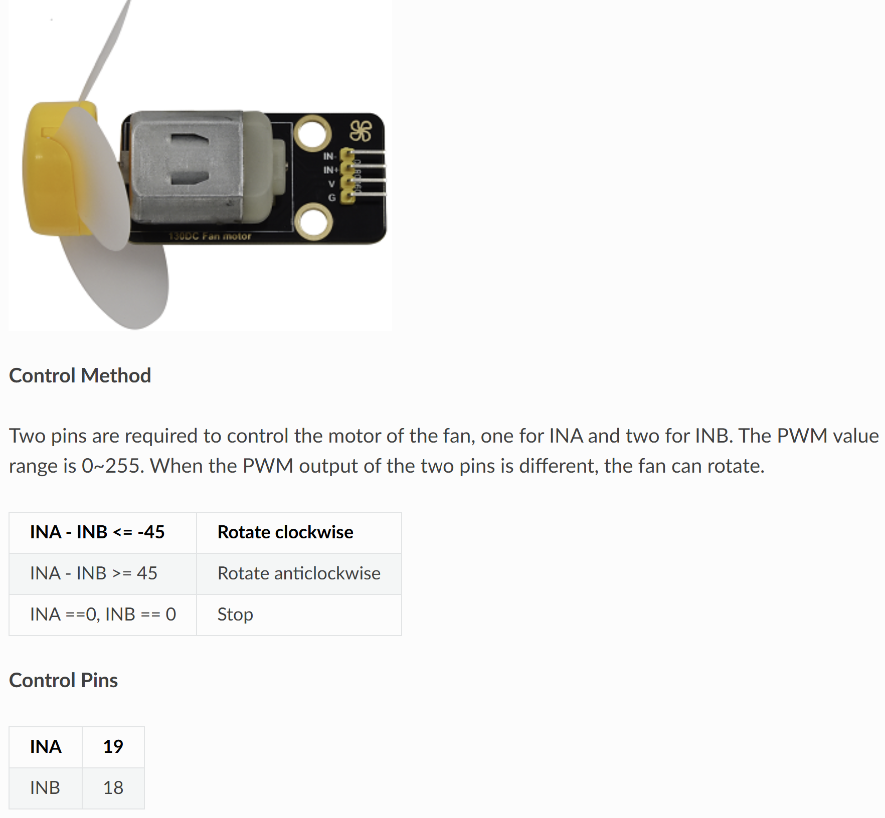

# 🌀 Opgave 03 – Subscribe og Styr Blæser med ESP32

I denne opgave skal du programmere ESP32 til at **modtage** MQTT-kommandoer og styre en blæser (fan) baseret på de modtagne beskeder. Dette er det modsatte af tidligere opgaver - nu lytter ESP32 i stedet for at sende!



## 🎯 Formål

Lær at:
- Subscribe til MQTT topics på ESP32
- Modtage og parse MQTT-beskeder
- Styre hardware (blæser med to pins) baseret på kommandoer
- Implementere callback-funktioner i MicroPython

---

## 💡 Python-kode

Opret en ny fil i Thonny og skriv følgende:

```python
# ESP32 MQTT Subscriber - Blæser kontrol
# Modtager "ON" eller "OFF" kommandoer via MQTT

import network
import time
from machine import Pin
from umqtt.simple import MQTTClient

# ===== KONFIGURATION - REDIGER DISSE VÆRDIER =====
WIFI_SSID = "DIT_WIFI_NAVN"
WIFI_PASSWORD = "DIT_WIFI_PASSWORD"

MQTT_BROKER = "test.mosquitto.org"
MQTT_TOPIC_FAN = b"stud/esp32/dit_navn/fan_control"  # bytes!
CLIENT_ID = b"esp32_fan_dit_navn"  # bytes!

# Blæser-pins (H-bro eller motor driver IN1/IN2)
FAN_PIN1 = 18  # GPIO 18
FAN_PIN2 = 19  # GPIO 19
# ==================================================

# Opsæt pins til blæser
fan_pin1 = Pin(FAN_PIN1, Pin.OUT, value=0)
fan_pin2 = Pin(FAN_PIN2, Pin.OUT, value=0)

def fan_off():
    """Sluk blæseren"""
    fan_pin1.value(0)
    fan_pin2.value(0)
    print('🌀 Blæser: OFF')

def fan_on():
    """Tænd blæseren (forward)"""
    fan_pin1.value(1)  # IN1 HIGH
    fan_pin2.value(0)  # IN2 LOW
    print('🌀 Blæser: ON')

# Forbind til WiFi
def connect_to_wifi():
    wlan = network.WLAN(network.STA_IF)
    wlan.active(True)
    if not wlan.isconnected():
        print('Forbinder til WiFi...')
        wlan.connect(WIFI_SSID, WIFI_PASSWORD)
        while not wlan.isconnected():
            time.sleep(0.5)
    print('WiFi forbundet!')
    print('IP-adresse:', wlan.ifconfig()[0])

# Global variabel til at gemme sidste kommando
_last_cmd = None

# MQTT callback-funktion (kaldes automatisk ved ny besked)
def mqtt_callback(topic, msg):
    """Kaldes når en MQTT-besked modtages"""
    global _last_cmd
    try:
        cmd = msg.decode().strip().upper()
    except:
        cmd = ""
    print(f'📨 MQTT modtaget: Topic={topic}, Besked={msg}')
    _last_cmd = cmd  # Gem kommando til main-loop

# Hovedprogram
def main():
    connect_to_wifi()
    
    # Opret MQTT klient og opsæt callback
    client = MQTTClient(CLIENT_ID, MQTT_BROKER)
    client.set_callback(mqtt_callback)
    client.connect()
    client.subscribe(MQTT_TOPIC_FAN)
    print(f'✅ MQTT subscribed til: {MQTT_TOPIC_FAN}')
    
    # Initial tilstand: Sluk blæser
    fan_off()
    
    print('👂 Lytter efter kommandoer...')
    
    # Event-loop: Tjek for beskeder og udfør kommandoer
    last_applied = None
    while True:
        # Tjek om der er nye MQTT-beskeder (kalder callback hvis ny besked)
        try:
            client.check_msg()
        except Exception as e:
            print(f'⚠️ MQTT fejl: {e}')
            # Prøv at genforbinde
            try:
                client.disconnect()
            except:
                pass
            time.sleep(2)
            client.connect()
            client.subscribe(MQTT_TOPIC_FAN)
            print('🔄 MQTT genforbundet')
        
        # Udfør kommando hvis den har ændret sig
        if _last_cmd != last_applied:
            if _last_cmd == "ON":
                fan_on()
                last_applied = _last_cmd
            elif _last_cmd == "OFF":
                fan_off()
                last_applied = _last_cmd
            else:
                if _last_cmd:  # Ignorer None/tom
                    print(f'❌ Ukendt kommando: {_last_cmd}')
        
        time.sleep(0.1)  # Tjek hver 100ms

# Start programmet
main()
```

### Konfigurér og kør

1. **Rediger følgende i koden:**
   - `WIFI_SSID` → Dit WiFi-navn
   - `WIFI_PASSWORD` → Dit WiFi-password
   - `dit_navn` i topic → Dit eget navn (fx `stud/esp32/anders/fan_control`)
   - `CLIENT_ID` → Unikt ID (fx `esp32_fan_anders`)

2. **Gem filen:**
   - **File → Save as → MicroPython device**
   - Gem som `fan_control.py` eller `main.py`

3. **Kør programmet:**
   - Tryk **F5**
   - Se output i Shell-vinduet

**Forventet output:**
```
Forbinder til WiFi...
WiFi forbundet!
IP-adresse: 192.168.1.123
✅ MQTT subscribed til: b'stud/esp32/anders/fan_control'
🌀 Blæser: OFF
👂 Lytter efter kommandoer...
📨 MQTT modtaget: Topic=b'stud/esp32/anders/fan_control', Besked=b'ON'
🌀 Blæser: ON
📨 MQTT modtaget: Topic=b'stud/esp32/anders/fan_control', Besked=b'OFF'
🌀 Blæser: OFF
```

✅ Din ESP32 lytter nu efter MQTT-kommandoer og styrer blæseren!

---

## 📝 Test med MQTT

For at teste din ESP32, skal du sende kommandoer til den via MQTT.

### Metode 1: MQTT Explorer
1. Åbn [MQTT Explorer](http://mqtt-explorer.com/)
2. Forbind til `test.mosquitto.org`
3. Klik **Publish**
4. Topic: `stud/esp32/dit_navn/fan_control`
5. Message: `ON` eller `OFF`

### Metode 2: Node-RED
```
[Inject "ON"] → [MQTT Out: topic "stud/esp32/dit_navn/fan_control"]
[Inject "OFF"] → [MQTT Out: topic "stud/esp32/dit_navn/fan_control"]
```

**Node-RED flow:**
1. Opret to `inject` nodes:
   - Node 1: `msg.payload = "ON"`
   - Node 2: `msg.payload = "OFF"`
2. Opret en `mqtt out` node:
   - Broker: `test.mosquitto.org`
   - Topic: `stud/esp32/dit_navn/fan_control`
3. Forbind begge inject-noder til mqtt out
4. Deploy og klik på inject-knapperne

---

## 🔍 Forklaring

**Sådan virker koden:**

1. **Subscribe**: ESP32 tilmelder sig et MQTT-topic
2. **Callback**: Når en besked modtages, kaldes `mqtt_callback()` automatisk
3. **Global variabel**: `_last_cmd` gemmer kommandoen fra callback
4. **Main loop**: Tjekker konstant om der er en ny kommando at udføre
5. **Hardware control**: 
   - `ON`: IN1=HIGH, IN2=LOW → Blæser kører fremad
   - `OFF`: IN1=LOW, IN2=LOW → Blæser stopper

**Gyldige kommandoer:**
- `ON` = Tænd blæser
- `OFF` = Sluk blæser
- Andre værdier ignoreres

**Hvorfor `check_msg()` i stedet for `wait_msg()`?**
- `check_msg()` returnerer straks → loop fortsætter
- `wait_msg()` blokerer indtil besked modtages → loop stopper
