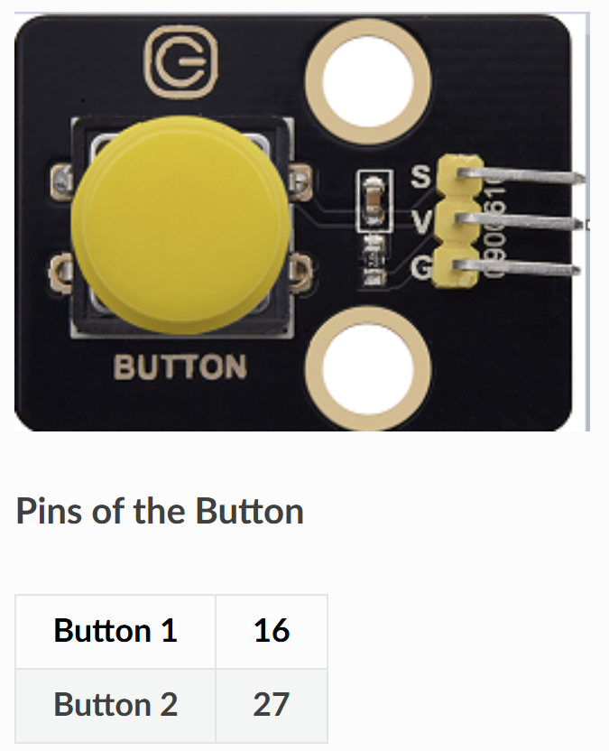

# 🔘 Opgave 04 – Publish Knapdata med ESP32

I denne opgave skal du programmere ESP32 til at læse input fra en fysisk knap og sende en MQTT-besked hver gang knappen trykkes. Dette viser hvordan man håndterer digital input med debouncing.



## 🎯 Formål

Lær at:
- Læse digital input fra en knap
- Implementere debouncing (undgå falske tryk)
- Sende event-baserede MQTT-beskeder
- Tælle antal knaptryk

---

## 💡 Python-kode

Opret en ny fil i Thonny og skriv følgende:

```python
# ESP32 + Knap MQTT Publisher
# Sender besked hver gang knappen trykkes

import time
import network
from machine import Pin, unique_id
import ubinascii
from umqtt.simple import MQTTClient

# ===== KONFIGURATION - REDIGER DISSE VÆRDIER =====
WIFI_SSID = "DIT_WIFI_NAVN"
WIFI_PASSWORD = "DIT_WIFI_PASSWORD"

MQTT_BROKER = "test.mosquitto.org"
MQTT_TOPIC_BUTTON = b"stud/esp32/dit_navn/button"
MQTT_TOPIC_COUNT = b"stud/esp32/dit_navn/button_count"

CLIENT_ID = b"esp32_button_dit_navn"

# Knap pin
BUTTON_PIN = 16  # GPIO 16

# Debounce tid i millisekunder
DEBOUNCE_TIME = 200  # 200ms
# ==================================================

# Opsæt knap med pull-up resistor
# Knappen forbindes mellem GPIO 16 og GND
button = Pin(BUTTON_PIN, Pin.IN, Pin.PULL_UP)

# Tæller til antal tryk
button_count = 0

# WiFi forbindelse
def wifi_connect(ssid, password):
    wlan = network.WLAN(network.STA_IF)
    wlan.active(True)
    if not wlan.isconnected():
        print('Forbinder til WiFi...')
        wlan.connect(ssid, password)
        while not wlan.isconnected():
            time.sleep(0.5)
    print('WiFi forbundet!')
    print('IP-adresse:', wlan.ifconfig()[0])
    return wlan

# Publish knaptryk
def publish_button_press(client, count):
    """Send besked når knap trykkes"""
    # Send "PRESSED" besked
    client.publish(MQTT_TOPIC_BUTTON, b"PRESSED")
    # Send tæller
    client.publish(MQTT_TOPIC_COUNT, str(count).encode())
    print(f'🔘 Knap trykket! Antal: {count}')

# Hovedprogram
def main():
    global button_count
    
    wifi_connect(WIFI_SSID, WIFI_PASSWORD)
    
    # Opret MQTT klient
    client_id = CLIENT_ID + b"_" + ubinascii.hexlify(unique_id())[-4:]
    client = MQTTClient(client_id, MQTT_BROKER)
    client.connect()
    print('✅ MQTT forbundet til:', MQTT_BROKER)
    print(f'📤 Publisher: {MQTT_TOPIC_BUTTON}')
    
    print('👂 Lytter efter knaptryk...')
    
    # Debouncing variabler
    last_button_state = button.value()
    last_press_time = 0
    
    # Hovedloop
    while True:
        # Læs aktuel knaptilstand (0 = trykket, 1 = ikke trykket pga. PULL_UP)
        current_button_state = button.value()
        current_time = time.ticks_ms()
        
        # Tjek om knappen er gået fra HIGH til LOW (trykket)
        if last_button_state == 1 and current_button_state == 0:
            # Tjek debounce-tid
            if time.ticks_diff(current_time, last_press_time) > DEBOUNCE_TIME:
                button_count += 1
                publish_button_press(client, button_count)
                last_press_time = current_time
        
        # Gem tilstand til næste iteration
        last_button_state = current_button_state
        
        # Kort pause for at spare CPU
        time.sleep(0.01)  # 10ms polling

# Start programmet
main()
```

### Konfigurér og kør

1. **Rediger følgende i koden:**
   - `WIFI_SSID` → Dit WiFi-navn
   - `WIFI_PASSWORD` → Dit WiFi-password
   - `dit_navn` i topics → Dit eget navn (fx `stud/esp32/anders/button`)
   - `CLIENT_ID` → Unikt ID (fx `esp32_button_anders`)

2. **Gem filen:**
   - **File → Save as → MicroPython device**
   - Gem som `button_sensor.py` eller `main.py`

3. **Kør programmet:**
   - Tryk **F5**
   - Se output i Shell-vinduet

**Forventet output:**
```
Forbinder til WiFi...
WiFi forbundet!
IP-adresse: 192.168.1.123
✅ MQTT forbundet til: test.mosquitto.org
📤 Publisher: b'stud/esp32/anders/button'
👂 Lytter efter knaptryk...
🔘 Knap trykket! Antal: 1
🔘 Knap trykket! Antal: 2
🔘 Knap trykket! Antal: 3
```

✅ Din ESP32 sender nu MQTT-beskeder ved knaptryk!

---

## 🧪 Test systemet

### Metode 1: MQTT Explorer
1. Åbn [MQTT Explorer](http://mqtt-explorer.com/)
2. Forbind til `test.mosquitto.org`
3. Find dine topics under `stud/esp32/dit_navn/`
4. Tryk på knappen og se beskeder opdatere live

### Metode 2: Node-RED

**Opret flow:**
```
[MQTT In: "button"] → [Debug]
[MQTT In: "button_count"] → [Text/Gauge node]
```

**Trin-for-trin:**
1. Opret `mqtt in` node med topic `stud/esp32/dit_navn/button`
2. Forbind til `debug` node
3. Opret `mqtt in` node med topic `stud/esp32/dit_navn/button_count`
4. Forbind til `text` node eller `gauge` node i dashboard
5. Deploy og tryk på knappen

---

## 📝 Forklaring

**Sådan virker koden:**

1. **Pull-up resistor**: 
   - Knappen er forbundet til GND
   - `Pin.PULL_UP` trækker pin til HIGH når knap ikke er trykket
   - Pin går til LOW når knappen trykkes
   - Derfor: `0 = trykket`, `1 = ikke trykket`

2. **Debouncing**:
   - Knapper kan "bounce" (oscillere) når de trykkes
   - Dette kan registreres som flere tryk
   - `DEBOUNCE_TIME` ignorer tryk der kommer inden 200ms
   - Kun første tryk inden for 200ms tælles

3. **Edge detection**:
   - Koden detekterer **falling edge** (HIGH → LOW)
   - Sender kun besked når knappen **trykkes**, ikke når den slippes
   - Undgår gentagne beskeder mens knappen holdes nede

4. **Event-driven**:
   - Sender kun MQTT når der sker noget (knaptryk)
   - Sparer båndbredde sammenlignet med konstant polling
   - To beskeder sendes: status ("PRESSED") og tæller

**MQTT Payload:**
- Topic `button`: `b"PRESSED"` når knappen trykkes
- Topic `button_count`: Tæller antal tryk (1, 2, 3, ...)

**Hvorfor 10ms polling?**
- Balance mellem responsivitet og CPU-forbrug
- Hurtig nok til at fange menneskelige knaptryk
- Langsom nok til ikke at spilde strøm
