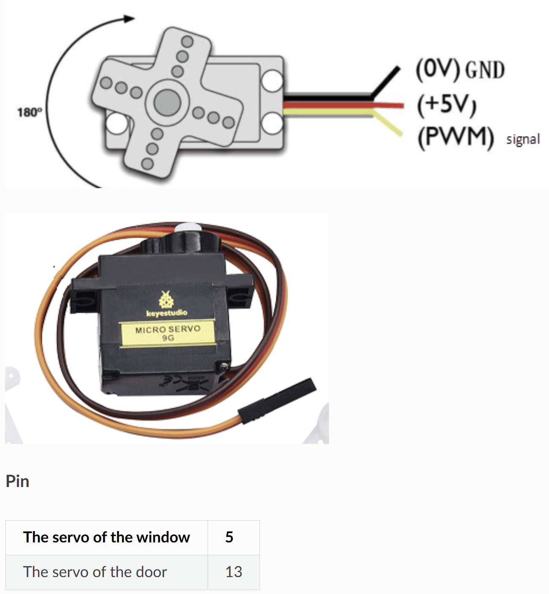

# 🚪 Opgave 06 – Styr Dør-Servo med ESP32

I denne opgave skal du programmere ESP32 til at **modtage** MQTT-kommandoer og styre en servo motor der åbner og lukker en dør. Servoen forbindes til GPIO 13.



## 🎯 Formål

Lær at:
- Styre en servo motor med PWM-signaler
- Modtage vinkel-kommandoer via MQTT
- Konvertere grader (0-180°) til PWM duty cycle
- Implementere preset positioner (OPEN/CLOSE)

---

## 💡 Python-kode

Opret en ny fil i Thonny og skriv følgende:

```python
# ESP32 MQTT Subscriber - Dør Servo Kontrol
# Modtager vinkel-kommandoer (0-180) eller OPEN/CLOSE via MQTT

import network
import time
from machine import Pin, PWM
from umqtt.simple import MQTTClient

# ===== KONFIGURATION - REDIGER DISSE VÆRDIER =====
WIFI_SSID = "DIT_WIFI_NAVN"
WIFI_PASSWORD = "DIT_WIFI_PASSWORD"

MQTT_BROKER = "test.mosquitto.org"
MQTT_TOPIC_DOOR = b"stud/esp32/dit_navn/door"
CLIENT_ID = b"esp32_door_dit_navn"

# Servo pin
SERVO_PIN = 13  # GPIO 13 til dør-servo

# Servo positioner
DOOR_CLOSED = 0      # 0 grader = lukket
DOOR_OPEN = 90       # 90 grader = åben
# ==================================================

# Opsæt PWM til servo
servo = PWM(Pin(SERVO_PIN), freq=50)  # 50Hz for standard servo

# Konverter grader (0-180) til duty cycle
def angle_to_duty(angle):
    """
    Servoen forventer PWM signal:
    - 0.5ms (2.5% duty) = 0 grader
    - 1.5ms (7.5% duty) = 90 grader
    - 2.5ms (12.5% duty) = 180 grader
    
    Duty cycle beregnes som: (angle / 180) * (12.5 - 2.5) + 2.5
    Men ESP32's PWM duty er 0-1023, så vi ganger med 1023/100
    """
    # Begræns vinkel til 0-180
    angle = max(0, min(180, angle))
    
    # Beregn duty cycle i procent (2.5% til 12.5%)
    duty_percent = (angle / 180) * 10 + 2.5
    
    # Konverter til 0-1023 range
    duty = int(duty_percent * 1023 / 100)
    
    return duty

def set_servo_angle(angle):
    """Sæt servo til specifik vinkel"""
    duty = angle_to_duty(angle)
    servo.duty(duty)
    print(f'🚪 Dør servo: {angle}°')

# WiFi forbindelse
def wifi_connect(ssid, password):
    wlan = network.WLAN(network.STA_IF)
    wlan.active(True)
    if not wlan.isconnected():
        print('Forbinder til WiFi...')
        wlan.connect(ssid, password)
        while not wlan.isconnected():
            time.sleep(0.5)
    print('WiFi forbundet!')
    print('IP-adresse:', wlan.ifconfig()[0])

# Global variabel til servo kommando
_servo_cmd = None

# MQTT callback
def mqtt_callback(topic, msg):
    """Kaldes når MQTT-besked modtages"""
    global _servo_cmd
    try:
        cmd = msg.decode().strip().upper()
    except:
        cmd = ""
    print(f'📨 MQTT modtaget: {msg}')
    _servo_cmd = cmd

# Hovedprogram
def main():
    wifi_connect(WIFI_SSID, WIFI_PASSWORD)
    
    # Opret MQTT klient
    client = MQTTClient(CLIENT_ID, MQTT_BROKER)
    client.set_callback(mqtt_callback)
    client.connect()
    client.subscribe(MQTT_TOPIC_DOOR)
    print(f'✅ MQTT subscribed til: {MQTT_TOPIC_DOOR}')
    
    # Initial position: lukket
    set_servo_angle(DOOR_CLOSED)
    
    print('👂 Lytter efter kommandoer...')
    print('   Gyldige: OPEN, CLOSE, eller vinkel 0-180')
    
    last_cmd = None
    
    # Event-loop
    while True:
        try:
            client.check_msg()
        except Exception as e:
            print(f'⚠️ MQTT fejl: {e}')
            try:
                client.disconnect()
            except:
                pass
            time.sleep(2)
            client.connect()
            client.subscribe(MQTT_TOPIC_DOOR)
        
        # Udfør kommando hvis ændret
        if _servo_cmd != last_cmd and _servo_cmd is not None:
            if _servo_cmd == "OPEN":
                set_servo_angle(DOOR_OPEN)
                last_cmd = _servo_cmd
            elif _servo_cmd == "CLOSE":
                set_servo_angle(DOOR_CLOSED)
                last_cmd = _servo_cmd
            else:
                # Prøv at parse som vinkel
                try:
                    angle = int(_servo_cmd)
                    if 0 <= angle <= 180:
                        set_servo_angle(angle)
                        last_cmd = _servo_cmd
                    else:
                        print(f'❌ Vinkel skal være 0-180: {angle}')
                except ValueError:
                    print(f'❌ Ukendt kommando: {_servo_cmd}')
        
        time.sleep(0.1)

# Start programmet
main()
```

### Konfigurér og kør

1. **Rediger følgende i koden:**
   - `WIFI_SSID` → Dit WiFi-navn
   - `WIFI_PASSWORD` → Dit WiFi-password
   - `dit_navn` i topic → Dit eget navn (fx `stud/esp32/anders/door`)
   - `CLIENT_ID` → Unikt ID (fx `esp32_door_anders`)

2. **Gem filen:**
   - **File → Save as → MicroPython device**
   - Gem som `door_servo.py` eller `main.py`

3. **Kør programmet:**
   - Tryk **F5**
   - Se output i Shell-vinduet

**Forventet output:**
```
Forbinder til WiFi...
WiFi forbundet!
IP-adresse: 192.168.1.123
✅ MQTT subscribed til: b'stud/esp32/anders/door'
🚪 Dør servo: 0°
👂 Lytter efter kommandoer...
   Gyldige: OPEN, CLOSE, eller vinkel 0-180
📨 MQTT modtaget: b'OPEN'
🚪 Dør servo: 90°
📨 MQTT modtaget: b'CLOSE'
🚪 Dør servo: 0°
📨 MQTT modtaget: b'60'
🚪 Dør servo: 60°
```

✅ Din ESP32 styrer nu dør-servoen via MQTT!

---

## 🧪 Test systemet

### Metode 1: MQTT Explorer
1. Åbn MQTT Explorer og forbind til `test.mosquitto.org`
2. Publish til topic `stud/esp32/dit_navn/door`
3. Send kommandoer:
   - `OPEN` = Åbn dør (90°)
   - `CLOSE` = Luk dør (0°)
   - `45` = Delvist åben (45°)
   - `180` = Fuldt åben (180°)

### Metode 2: Node-RED

**Opret flow:**
```
[Inject "OPEN"] → [MQTT Out: topic "door"]
[Inject "CLOSE"] → [MQTT Out: topic "door"]
[Slider 0-180] → [MQTT Out: topic "door"]
```

**Trin-for-trin:**
1. Opret `inject` node med `msg.payload = "OPEN"`
2. Opret `inject` node med `msg.payload = "CLOSE"`
3. Opret `inject` node med `msg.payload = "45"` (delvist åben)
4. Opret `mqtt out` node:
   - Broker: `test.mosquitto.org`
   - Topic: `stud/esp32/dit_navn/door`
5. Forbind alle inject-noder til mqtt out
6. Deploy og test!

**Bonus - Dashboard med knapper:**
Du kan oprette en dashboard med OPEN/CLOSE knapper for nem styring!

---

## 📝 Forklaring

**Sådan virker servoen:**

1. **PWM frekvens**: 50Hz (standard for servomotorer)
   - En periode er 20ms (1/50Hz)
   
2. **Pulse width bestemmer vinkel:**
   - 0.5ms pulse = 0° (dør lukket)
   - 1.5ms pulse = 90° (dør åben)
   - 2.5ms pulse = 180° (helt åben)

3. **Duty cycle beregning:**
   - 0.5ms af 20ms = 2.5% duty cycle = 0°
   - 2.5ms af 20ms = 12.5% duty cycle = 180°
   - ESP32 PWM duty: 0-1023 (10-bit)
   - Formel: `duty = (angle/180 * 10 + 2.5) * 1023/100`

4. **Kommando-typer:**
   - **Preset**: `OPEN` / `CLOSE` - hurtig styring
   - **Præcis**: `0` til `180` - fuld kontrol over vinkel

**MQTT Kommandoer:**
- `OPEN` → 90° (dør åben)
- `CLOSE` → 0° (dør lukket)  
- `0-180` → Præcis vinkel (fx `60` for delvist åben)

**Forskel mellem vindue og dør:**
- Samme mekanik, forskellig funktion
- Kan tilpasses forskellige åbningsvinkler efter behov
- GPIO 13 i stedet for GPIO 5
- Topic `door` i stedet for `window`
