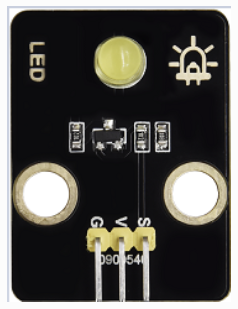
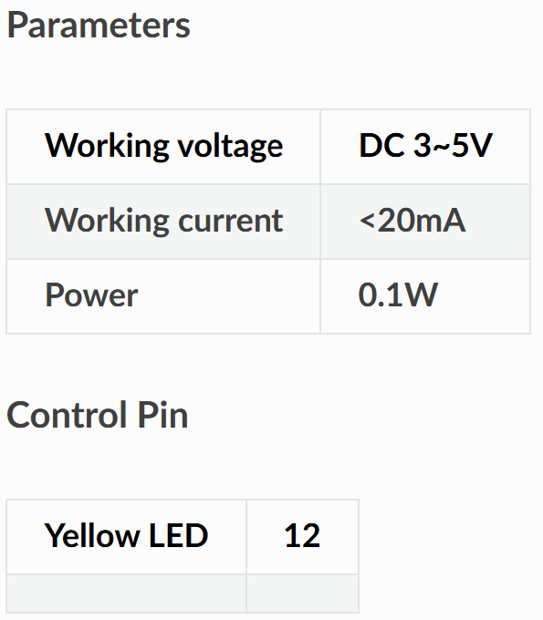

# 💡 Opgave 07 – Styr Gul LED med ESP32

I denne opgave skal du programmere ESP32 til at **modtage** MQTT-kommandoer og styre en gul LED. LED'en kan tændes og slukkes via MQTT-beskeder.




## 🎯 Formål

Lær at:
- Styre en digital output (LED) fra ESP32
- Modtage ON/OFF kommandoer via MQTT
- Implementere simpel aktuator-styring
- Arbejde med GPIO output pins

---

## 💡 Python-kode

Opret en ny fil i Thonny og skriv følgende:

```python
# ESP32 MQTT Subscriber - Gul LED Kontrol
# Modtager ON/OFF kommandoer via MQTT

import network
import time
from machine import Pin
from umqtt.simple import MQTTClient

# ===== KONFIGURATION - REDIGER DISSE VÆRDIER =====
WIFI_SSID = "DIT_WIFI_NAVN"
WIFI_PASSWORD = "DIT_WIFI_PASSWORD"

MQTT_BROKER = "test.mosquitto.org"
MQTT_TOPIC_LED = b"stud/esp32/dit_navn/yellow_led"
CLIENT_ID = b"esp32_led_dit_navn"

# LED pin
LED_PIN = 12  # GPIO 12 til gul LED
# ==================================================

# Opsæt LED som output
led = Pin(LED_PIN, Pin.OUT)

# LED funktioner
def led_on():
    """Tænd LED"""
    led.value(1)
    print('💡 Gul LED: ON')

def led_off():
    """Sluk LED"""
    led.value(0)
    print('💡 Gul LED: OFF')

# WiFi forbindelse
def wifi_connect(ssid, password):
    wlan = network.WLAN(network.STA_IF)
    wlan.active(True)
    if not wlan.isconnected():
        print('Forbinder til WiFi...')
        wlan.connect(ssid, password)
        while not wlan.isconnected():
            time.sleep(0.5)
    print('WiFi forbundet!')
    print('IP-adresse:', wlan.ifconfig()[0])

# Global variabel til LED kommando
_led_cmd = None

# MQTT callback
def mqtt_callback(topic, msg):
    """Kaldes når MQTT-besked modtages"""
    global _led_cmd
    try:
        cmd = msg.decode().strip().upper()
    except:
        cmd = ""
    print(f'📨 MQTT modtaget: {msg}')
    _led_cmd = cmd

# Hovedprogram
def main():
    wifi_connect(WIFI_SSID, WIFI_PASSWORD)
    
    # Opret MQTT klient
    client = MQTTClient(CLIENT_ID, MQTT_BROKER)
    client.set_callback(mqtt_callback)
    client.connect()
    client.subscribe(MQTT_TOPIC_LED)
    print(f'✅ MQTT subscribed til: {MQTT_TOPIC_LED}')
    
    # Initial tilstand: slukket
    led_off()
    
    print('👂 Lytter efter kommandoer...')
    print('   Gyldige: ON, OFF')
    
    last_cmd = None
    
    # Event-loop
    while True:
        try:
            client.check_msg()
        except Exception as e:
            print(f'⚠️ MQTT fejl: {e}')
            try:
                client.disconnect()
            except:
                pass
            time.sleep(2)
            client.connect()
            client.subscribe(MQTT_TOPIC_LED)
        
        # Udfør kommando hvis ændret
        if _led_cmd != last_cmd and _led_cmd is not None:
            if _led_cmd == "ON":
                led_on()
                last_cmd = _led_cmd
            elif _led_cmd == "OFF":
                led_off()
                last_cmd = _led_cmd
            else:
                print(f'❌ Ukendt kommando: {_led_cmd}')
        
        time.sleep(0.1)

# Start programmet
main()
```

### Konfigurér og kør

1. **Rediger følgende i koden:**
   - `WIFI_SSID` → Dit WiFi-navn
   - `WIFI_PASSWORD` → Dit WiFi-password
   - `dit_navn` i topic → Dit eget navn (fx `stud/esp32/anders/yellow_led`)
   - `CLIENT_ID` → Unikt ID (fx `esp32_led_anders`)

2. **Gem filen:**
   - **File → Save as → MicroPython device**
   - Gem som `yellow_led.py` eller `main.py`

3. **Kør programmet:**
   - Tryk **F5**
   - Se output i Shell-vinduet

**Forventet output:**
```
Forbinder til WiFi...
WiFi forbundet!
IP-adresse: 192.168.1.123
✅ MQTT subscribed til: b'stud/esp32/anders/yellow_led'
💡 Gul LED: OFF
👂 Lytter efter kommandoer...
   Gyldige: ON, OFF
📨 MQTT modtaget: b'ON'
💡 Gul LED: ON
📨 MQTT modtaget: b'OFF'
💡 Gul LED: OFF
```

✅ Din ESP32 styrer nu den gule LED via MQTT!

---

## 🧪 Test systemet

### Metode 1: MQTT Explorer
1. Åbn MQTT Explorer og forbind til `test.mosquitto.org`
2. Publish til topic `stud/esp32/dit_navn/yellow_led`
3. Send kommandoer:
   - `ON` = Tænd LED
   - `OFF` = Sluk LED

### Metode 2: Node-RED

**Opret flow:**
```
[Inject "ON"] → [MQTT Out: topic "yellow_led"]
[Inject "OFF"] → [MQTT Out: topic "yellow_led"]
```

**Trin-for-trin:**
1. Opret `inject` node med `msg.payload = "ON"`
2. Opret `inject` node med `msg.payload = "OFF"`
3. Opret `mqtt out` node:
   - Broker: `test.mosquitto.org`
   - Topic: `stud/esp32/dit_navn/yellow_led`
4. Forbind begge inject-noder til mqtt out
5. Deploy og test!

**Bonus - Toggle switch:**
Du kan oprette en dashboard toggle switch node for nem ON/OFF styring!

**Bonus - Blinking:**
Send en række af ON/OFF beskeder hurtigt efter hinanden for at få LED'en til at blinke!

---

## 📝 Forklaring

**Sådan virker koden:**

1. **GPIO Output**:
   - `Pin.OUT` konfigurerer GPIO som output
   - `led.value(1)` tænder LED (HIGH = 3.3V)
   - `led.value(0)` slukker LED (LOW = 0V)

2. **MQTT Subscribe**:
   - ESP32 lytter konstant på topic `yellow_led`
   - Når besked modtages, kaldes `mqtt_callback()`
   - Kommando gemmes i global variabel `_led_cmd`

3. **Event-driven**:
   - Main loop tjekker for nye kommandoer
   - Udfører kun handling når kommando ændrer sig
   - Undgår at tænde/slukke LED'en gentagne gange

4. **Simple kommandoer**:
   - `ON` = Tænd LED
   - `OFF` = Sluk LED
   - Alle andre værdier ignoreres med fejlbesked

**MQTT Kommandoer:**
- `ON` → LED tændes (GPIO HIGH)
- `OFF` → LED slukkes (GPIO LOW)

**Elektrisk:**
- GPIO output: 3.3V når HIGH
- LED + modstand forbindes mellem GPIO og GND
- Strømbegrænsende modstand (220-330Ω) beskytter LED
