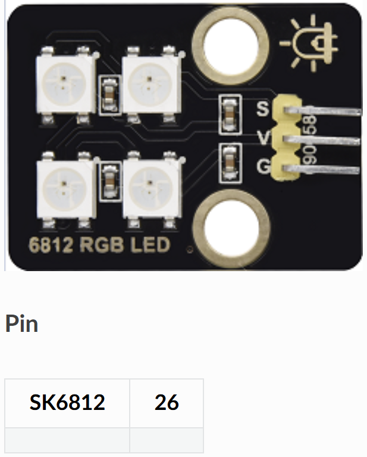

# 🌈 Opgave 08 – Styr RGB LED med ESP32

I denne opgave skal du programmere ESP32 til at **modtage** MQTT-kommandoer og styre en RGB LED (SK6812). LED'en kan skifte farve via MQTT-beskeder. SK6812 er en adresserbar RGB LED der styres med en enkelt data-pin.



## 🎯 Formål

Lær at:
- Styre en adresserbar RGB LED (NeoPixel/SK6812)
- Modtage farve-kommandoer via MQTT
- Arbejde med RGB farveværdier (0-255)
- Bruge NeoPixel biblioteket i MicroPython

---

## 💡 Python-kode

Opret en ny fil i Thonny og skriv følgende:

```python
# ESP32 MQTT Subscriber - RGB LED Kontrol
# Modtager farve-kommandoer via MQTT (SK6812)

import network
import time
from machine import Pin
from neopixel import NeoPixel
from umqtt.simple import MQTTClient

# ===== KONFIGURATION - REDIGER DISSE VÆRDIER =====
WIFI_SSID = "DIT_WIFI_NAVN"
WIFI_PASSWORD = "DIT_WIFI_PASSWORD"

MQTT_BROKER = "test.mosquitto.org"
MQTT_TOPIC_RGB = b"stud/esp32/dit_navn/rgb_led"
CLIENT_ID = b"esp32_rgb_dit_navn"

# RGB LED pin (SK6812)
RGB_PIN = 26  # GPIO 26
NUM_LEDS = 4  # Antal LED'er i kæden (SK6812 har ofte 4 LED'er)
# ==================================================

# Opsæt NeoPixel (SK6812)
np = NeoPixel(Pin(RGB_PIN), NUM_LEDS)

# Foruddefinerede farver (R, G, B) - hver værdi 0-255
COLORS = {
    "RED": (255, 0, 0),
    "GREEN": (0, 255, 0),
    "BLUE": (0, 0, 255),
    "YELLOW": (255, 255, 0),
    "CYAN": (0, 255, 255),
    "MAGENTA": (255, 0, 255),
    "WHITE": (255, 255, 255),
    "OFF": (0, 0, 0),
    "ORANGE": (255, 165, 0),
    "PURPLE": (128, 0, 128),
}

# RGB funktioner
def set_color(r, g, b):
    """Sæt alle LED'er til samme farve"""
    for i in range(NUM_LEDS):
        np[i] = (r, g, b)
    np.write()
    print(f'🌈 RGB LED: R={r}, G={g}, B={b}')

def set_color_by_name(color_name):
    """Sæt farve baseret på navn"""
    if color_name in COLORS:
        r, g, b = COLORS[color_name]
        set_color(r, g, b)
        return True
    return False

# WiFi forbindelse
def wifi_connect(ssid, password):
    wlan = network.WLAN(network.STA_IF)
    wlan.active(True)
    if not wlan.isconnected():
        print('Forbinder til WiFi...')
        wlan.connect(ssid, password)
        while not wlan.isconnected():
            time.sleep(0.5)
    print('WiFi forbundet!')
    print('IP-adresse:', wlan.ifconfig()[0])

# Global variabel til RGB kommando
_rgb_cmd = None

# MQTT callback
def mqtt_callback(topic, msg):
    """Kaldes når MQTT-besked modtages"""
    global _rgb_cmd
    try:
        cmd = msg.decode().strip().upper()
    except:
        cmd = ""
    print(f'📨 MQTT modtaget: {msg}')
    _rgb_cmd = cmd

# Parse RGB kommando (format: "R,G,B" eller farvenavn)
def parse_rgb_command(cmd):
    """Parse RGB kommando"""
    # Prøv først som farvenavn
    if set_color_by_name(cmd):
        return True
    
    # Prøv som R,G,B værdier
    try:
        parts = cmd.split(',')
        if len(parts) == 3:
            r = int(parts[0].strip())
            g = int(parts[1].strip())
            b = int(parts[2].strip())
            
            # Valider range
            if 0 <= r <= 255 and 0 <= g <= 255 and 0 <= b <= 255:
                set_color(r, g, b)
                return True
            else:
                print('❌ RGB værdier skal være 0-255')
    except:
        pass
    
    print(f'❌ Ukendt kommando: {cmd}')
    print('   Gyldige: RED, GREEN, BLUE, etc. eller "R,G,B"')
    return False

# Hovedprogram
def main():
    wifi_connect(WIFI_SSID, WIFI_PASSWORD)
    
    # Opret MQTT klient
    client = MQTTClient(CLIENT_ID, MQTT_BROKER)
    client.set_callback(mqtt_callback)
    client.connect()
    client.subscribe(MQTT_TOPIC_RGB)
    print(f'✅ MQTT subscribed til: {MQTT_TOPIC_RGB}')
    
    # Initial tilstand: slukket
    set_color(0, 0, 0)
    
    print('👂 Lytter efter kommandoer...')
    print('   Gyldige farver:', ', '.join(COLORS.keys()))
    print('   Eller send: "R,G,B" (fx "255,0,128")')
    
    last_cmd = None
    
    # Event-loop
    while True:
        try:
            client.check_msg()
        except Exception as e:
            print(f'⚠️ MQTT fejl: {e}')
            try:
                client.disconnect()
            except:
                pass
            time.sleep(2)
            client.connect()
            client.subscribe(MQTT_TOPIC_RGB)
        
        # Udfør kommando hvis ændret
        if _rgb_cmd != last_cmd and _rgb_cmd is not None:
            parse_rgb_command(_rgb_cmd)
            last_cmd = _rgb_cmd
        
        time.sleep(0.1)

# Start programmet
main()
```

### Konfigurér og kør

1. **Rediger følgende i koden:**
   - `WIFI_SSID` → Dit WiFi-navn
   - `WIFI_PASSWORD` → Dit WiFi-password
   - `dit_navn` i topic → Dit eget navn (fx `stud/esp32/anders/rgb_led`)
   - `CLIENT_ID` → Unikt ID (fx `esp32_rgb_anders`)
   - `NUM_LEDS` → Antal LED'er i din LED-strip (ofte 4)

2. **Gem filen:**
   - **File → Save as → MicroPython device**
   - Gem som `rgb_led.py` eller `main.py`

3. **Kør programmet:**
   - Tryk **F5**
   - Se output i Shell-vinduet

**Forventet output:**
```
Forbinder til WiFi...
WiFi forbundet!
IP-adresse: 192.168.1.123
✅ MQTT subscribed til: b'stud/esp32/anders/rgb_led'
🌈 RGB LED: R=0, G=0, B=0
👂 Lytter efter kommandoer...
   Gyldige farver: RED, GREEN, BLUE, YELLOW, CYAN, MAGENTA, WHITE, OFF, ORANGE, PURPLE
   Eller send: "R,G,B" (fx "255,0,128")
📨 MQTT modtaget: b'RED'
🌈 RGB LED: R=255, G=0, B=0
📨 MQTT modtaget: b'0,255,128'
🌈 RGB LED: R=0, G=255, B=128
```

✅ Din ESP32 styrer nu RGB LED'en via MQTT!

---

## 🧪 Test systemet

### Metode 1: MQTT Explorer
1. Åbn MQTT Explorer og forbind til `test.mosquitto.org`
2. Publish til topic `stud/esp32/dit_navn/rgb_led`
3. Send kommandoer:
   - **Farvenavne**: `RED`, `GREEN`, `BLUE`, `YELLOW`, `CYAN`, `MAGENTA`, `WHITE`, `ORANGE`, `PURPLE`, `OFF`
   - **RGB værdier**: `255,0,0` (rød), `0,255,0` (grøn), `128,0,255` (lilla)

### Metode 2: Node-RED

**Opret flow med farve-knapper:**
```
[Inject "RED"] → [MQTT Out: topic "rgb_led"]
[Inject "GREEN"] → [MQTT Out: topic "rgb_led"]
[Inject "BLUE"] → [MQTT Out: topic "rgb_led"]
[Inject "OFF"] → [MQTT Out: topic "rgb_led"]
```

**Trin-for-trin:**
1. Opret flere `inject` nodes med forskellige farver
2. Opret `mqtt out` node:
   - Broker: `test.mosquitto.org`
   - Topic: `stud/esp32/dit_navn/rgb_led`
3. Forbind alle inject-noder til mqtt out
4. Deploy og test!

**Bonus - Farve picker:**
Du kan bruge en `color picker` node til at vælge præcis farve, og derefter en `function` node til at konvertere til "R,G,B" format:
```javascript
const color = msg.payload;
const r = parseInt(color.substring(1, 3), 16);
const g = parseInt(color.substring(3, 5), 16);
const b = parseInt(color.substring(5, 7), 16);
msg.payload = `${r},${g},${b}`;
return msg;
```

---

## 📝 Forklaring

**Sådan virker SK6812/NeoPixel:**

1. **One-wire protokol**:
   - Alle LED'er forbindes i en kæde
   - Én data-pin styrer alle LED'er
   - Data sendes serielt fra ESP32 til LED'erne

2. **RGB værdier**:
   - Hver LED har 3 kanaler: Red (R), Green (G), Blue (B)
   - Hver kanal: 0-255 (0 = slukket, 255 = maksimal styrke)
   - `(255, 0, 0)` = Ren rød
   - `(0, 255, 0)` = Ren grøn
   - `(255, 255, 0)` = Gul (rød + grøn)

3. **NeoPixel bibliotek**:
   - `NeoPixel(pin, antal)` opretter LED-objekt
   - `np[i] = (r, g, b)` sætter farve for LED nummer i
   - `np.write()` sender farver til LED'erne

4. **Kommando-formater**:
   - **Navngivne farver**: `RED`, `BLUE`, `GREEN`, etc.
   - **Custom RGB**: `"255,128,64"` (rød=255, grøn=128, blå=64)

**MQTT Kommandoer:**
- `RED` → Rød (255,0,0)
- `GREEN` → Grøn (0,255,0)
- `BLUE` → Blå (0,0,255)
- `WHITE` → Hvid (255,255,255)
- `OFF` → Slukket (0,0,0)
- `255,128,0` → Orange (custom RGB)

**Adresserbare LED'er:**
- Hver LED kan have sin egen farve
- Koden sætter alle 4 LED'er til samme farve
- Du kan modificere koden til at kontrollere hver LED individuelt
