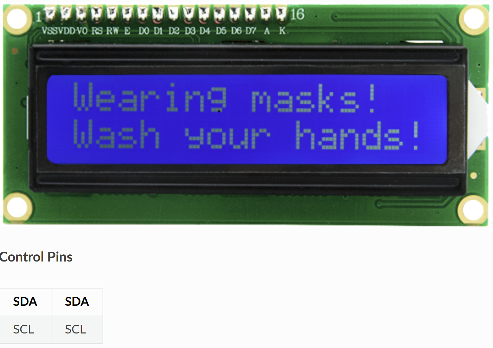

# 📟 Opgave 09 – LCD 1602 Display med ESP32

I denne opgave skal du programmere ESP32 til at **modtage** MQTT-beskeder og vise dem på et LCD 1602 display. Displayet har 16 karakterer x 2 linjer og kommunikerer via I2C.



## 🎯 Formål

Lær at:
- Styre et I2C LCD display fra ESP32
- Modtage tekst via MQTT og vise den på displayet
- Arbejde med I2C kommunikation (SDA/SCL)
- Formatere tekst til LCD (16x2 karakterer)

---

## 💡 Python-kode

Opret en ny fil i Thonny og skriv følgende:

```python
# ESP32 MQTT Subscriber - LCD 1602 Display
# Modtager tekst via MQTT og viser på LCD

import network
import time
from machine import Pin, I2C
from umqtt.simple import MQTTClient

# ===== KONFIGURATION - REDIGER DISSE VÆRDIER =====
WIFI_SSID = "DIT_WIFI_NAVN"
WIFI_PASSWORD = "DIT_WIFI_PASSWORD"

MQTT_BROKER = "test.mosquitto.org"
MQTT_TOPIC_LCD = b"stud/esp32/dit_navn/lcd"
CLIENT_ID = b"esp32_lcd_dit_navn"

# I2C pins (ESP32 standard)
I2C_SDA = 21  # GPIO 21
I2C_SCL = 22  # GPIO 22
I2C_ADDR = 0x27  # I2C adresse (almindeligvis 0x27 eller 0x3F)
# ==================================================

# LCD 1602 I2C driver (grundlæggende implementering)
class LCD1602:
    def __init__(self, i2c, addr=0x27):
        self.i2c = i2c
        self.addr = addr
        self.backlight = 0x08
        time.sleep_ms(20)
        self._write(0x03)
        self._write(0x03)
        self._write(0x03)
        self._write(0x02)
        self._write(0x28)  # 2 linjer, 5x8 dots
        self._write(0x0C)  # Display on, cursor off
        self._write(0x06)  # Entry mode
        self.clear()
    
    def _write_nibble(self, data):
        self.i2c.writeto(self.addr, bytearray([data | self.backlight]))
        time.sleep_us(1)
        self.i2c.writeto(self.addr, bytearray([data | 0x04 | self.backlight]))
        time.sleep_us(1)
        self.i2c.writeto(self.addr, bytearray([data | self.backlight]))
        time.sleep_us(50)
    
    def _write(self, data, mode=0):
        self._write_nibble((data & 0xF0) | mode)
        self._write_nibble(((data << 4) & 0xF0) | mode)
    
    def clear(self):
        """Ryd display"""
        self._write(0x01)
        time.sleep_ms(2)
    
    def set_cursor(self, col, row):
        """Flyt cursor til position (col, row)"""
        addr = 0x80 + (0x40 * row) + col
        self._write(addr)
    
    def print(self, text):
        """Udskriv tekst på nuværende cursor position"""
        for char in text:
            self._write(ord(char), 0x01)
    
    def display(self, line1="", line2=""):
        """Vis tekst på linje 1 og 2 (max 16 karakterer hver)"""
        self.clear()
        # Linje 1
        self.set_cursor(0, 0)
        self.print(line1[:16])
        # Linje 2
        self.set_cursor(0, 1)
        self.print(line2[:16])

# WiFi forbindelse
def wifi_connect(ssid, password):
    wlan = network.WLAN(network.STA_IF)
    wlan.active(True)
    if not wlan.isconnected():
        print('Forbinder til WiFi...')
        wlan.connect(ssid, password)
        while not wlan.isconnected():
            time.sleep(0.5)
    print('WiFi forbundet!')
    print('IP-adresse:', wlan.ifconfig()[0])

# Global variabel til LCD tekst
_lcd_text = None

# MQTT callback
def mqtt_callback(topic, msg):
    """Kaldes når MQTT-besked modtages"""
    global _lcd_text
    try:
        text = msg.decode()
    except:
        text = ""
    print(f'📨 MQTT modtaget: {msg}')
    _lcd_text = text

# Parse LCD kommando (format: "Linje1|Linje2" eller bare "Tekst")
def parse_lcd_text(text):
    """Parse LCD tekst - opdel i 2 linjer"""
    if '|' in text:
        # Split ved pipe symbol
        parts = text.split('|', 1)
        line1 = parts[0][:16]
        line2 = parts[1][:16] if len(parts) > 1 else ""
    else:
        # Hvis tekst er længere end 16 karakterer, wrap til linje 2
        if len(text) <= 16:
            line1 = text
            line2 = ""
        else:
            line1 = text[:16]
            line2 = text[16:32]
    
    return line1, line2

# Hovedprogram
def main():
    wifi_connect(WIFI_SSID, WIFI_PASSWORD)
    
    # Opsæt I2C og LCD
    print('Initialiserer LCD...')
    i2c = I2C(0, scl=Pin(I2C_SCL), sda=Pin(I2C_SDA), freq=100000)
    
    # Scan for I2C enheder
    devices = i2c.scan()
    if devices:
        print(f'I2C enheder fundet: {[hex(d) for d in devices]}')
    else:
        print('⚠️ Ingen I2C enheder fundet!')
        print('Tjek forbindelser: SDA, SCL, VCC, GND')
        return
    
    # Opret LCD objekt
    lcd = LCD1602(i2c, I2C_ADDR)
    print('✅ LCD initialiseret!')
    
    # Opret MQTT klient
    client = MQTTClient(CLIENT_ID, MQTT_BROKER)
    client.set_callback(mqtt_callback)
    client.connect()
    client.subscribe(MQTT_TOPIC_LCD)
    print(f'✅ MQTT subscribed til: {MQTT_TOPIC_LCD}')
    
    # Velkomstbesked
    lcd.display("ESP32 LCD", "Venter...")
    
    print('👂 Lytter efter tekst...')
    print('   Format: "Linje1|Linje2" eller bare "Tekst"')
    
    last_text = None
    
    # Event-loop
    while True:
        try:
            client.check_msg()
        except Exception as e:
            print(f'⚠️ MQTT fejl: {e}')
            try:
                client.disconnect()
            except:
                pass
            time.sleep(2)
            client.connect()
            client.subscribe(MQTT_TOPIC_LCD)
        
        # Opdater LCD hvis ny tekst
        if _lcd_text != last_text and _lcd_text is not None:
            line1, line2 = parse_lcd_text(_lcd_text)
            lcd.display(line1, line2)
            print(f'📟 LCD opdateret:')
            print(f'   Linje 1: "{line1}"')
            print(f'   Linje 2: "{line2}"')
            last_text = _lcd_text
        
        time.sleep(0.1)

# Start programmet
main()
```

### Konfigurér og kør

1. **Rediger følgende i koden:**
   - `WIFI_SSID` → Dit WiFi-navn
   - `WIFI_PASSWORD` → Dit WiFi-password
   - `dit_navn` i topic → Dit eget navn (fx `stud/esp32/anders/lcd`)
   - `CLIENT_ID` → Unikt ID (fx `esp32_lcd_anders`)
   - `I2C_ADDR` → Tjek I2C adresse (0x27 eller 0x3F)

2. **Gem filen:**
   - **File → Save as → MicroPython device**
   - Gem som `lcd_display.py` eller `main.py`

3. **Kør programmet:**
   - Tryk **F5**
   - Se output i Shell-vinduet

**Forventet output:**
```
Forbinder til WiFi...
WiFi forbundet!
IP-adresse: 192.168.1.123
Initialiserer LCD...
I2C enheder fundet: ['0x27']
✅ LCD initialiseret!
✅ MQTT subscribed til: b'stud/esp32/anders/lcd'
👂 Lytter efter tekst...
   Format: "Linje1|Linje2" eller bare "Tekst"
📨 MQTT modtaget: b'Hello World!'
📟 LCD opdateret:
   Linje 1: "Hello World!"
   Linje 2: ""
📨 MQTT modtaget: b'Wearing masks!|Wash your hands!'
📟 LCD opdateret:
   Linje 1: "Wearing masks!"
   Linje 2: "Wash your hands!"
```

✅ Din ESP32 viser nu MQTT-beskeder på LCD displayet!

---

## 🧪 Test systemet

### Metode 1: MQTT Explorer
1. Åbn MQTT Explorer og forbind til `test.mosquitto.org`
2. Publish til topic `stud/esp32/dit_navn/lcd`
3. Send tekst:
   - **Én linje**: `Hello World!`
   - **To linjer**: `Temperatur|23.5 grader`
   - **Lang tekst**: `Dette er en lang tekst som wraps` (auto-wrap til linje 2)

### Metode 2: Node-RED

**Opret flow med text input:**
```
[Inject/Text Input] → [MQTT Out: topic "lcd"]
```

**Trin-for-trin:**
1. Opret `inject` nodes med foruddefinerede beskeder:
   - `"Hello ESP32!"`
   - `"Temp: 22.5C|Humid: 55%"`
   - `"System OK|Status: Running"`
2. Opret `mqtt out` node:
   - Broker: `test.mosquitto.org`
   - Topic: `stud/esp32/dit_navn/lcd`
3. Forbind inject-noder til mqtt out
4. Deploy og test!

**Bonus - Dashboard text input:**
Du kan bruge en dashboard `text input` node til at skrive custom beskeder direkte!

**Eksempel med sensor data:**
Kombiner med DHT11 opgave - send temperatur/fugtighed til LCD:
```
[DHT11 sensor] → [Function: format] → [MQTT Out: lcd topic]
```

Function node:
```javascript
msg.payload = `Temp: ${msg.payload.temp}C|Hum: ${msg.payload.hum}%`;
return msg;
```

---

## 📝 Forklaring

**Sådan virker LCD 1602 I2C:**

1. **I2C kommunikation**:
   - **SDA** (Serial Data) = GPIO 21 - Data linje
   - **SCL** (Serial Clock) = GPIO 22 - Clock linje
   - **Adresse**: Hver I2C enhed har en unik adresse (typisk 0x27 eller 0x3F)
   - I2C kan forbinde mange enheder på samme 2 ledninger

2. **LCD display**:
   - **16x2** = 16 karakterer bredt, 2 linjer højt
   - Hver karakter er 5x8 pixels
   - HD44780 controller (standard for LCD 1602)

3. **Display opdatering**:
   - `clear()` - Sletter hele displayet
   - `set_cursor(col, row)` - Flytter cursor til position
   - `print(text)` - Skriver tekst fra cursor position
   - `display(line1, line2)` - Rydder og viser 2 linjer

4. **Tekst format**:
   - **Pipe separator**: `"Linje1|Linje2"` - Opdel tekst eksplicit
   - **Auto-wrap**: Lang tekst wraps automatisk til linje 2
   - **Max længde**: 16 karakterer per linje (afskæres automatisk)

**MQTT Kommandoer:**
- `Hello World!` → Viser på linje 1
- `Line 1|Line 2` → Opdeler ved `|` symbol
- `Temperature: 23.5|Humidity: 58.2%` → Sensor data format

**I2C scanning:**
Programmet scanner automatisk for I2C enheder ved opstart. Hvis LCD ikke findes:
- Tjek SDA/SCL forbindelser
- Tjek VCC (5V eller 3.3V) og GND
- Prøv anden I2C adresse (0x3F i stedet for 0x27)

**Adresse bestemmelse:**
Hvis LCD ikke virker med 0x27, prøv dette i REPL:
```python
from machine import Pin, I2C
i2c = I2C(0, scl=Pin(22), sda=Pin(21))
print(hex(i2c.scan()[0]))  # Viser korrekt adresse
```
