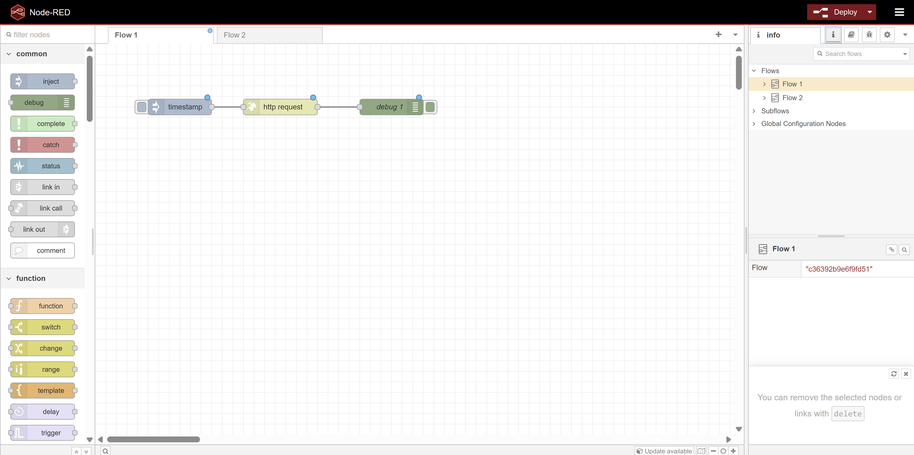
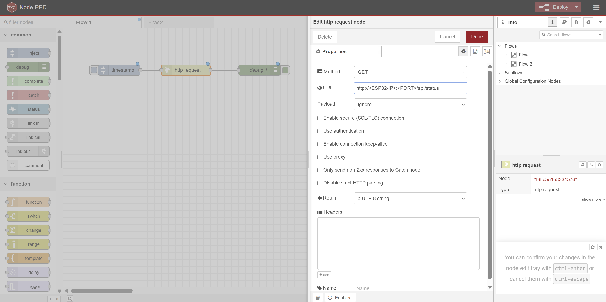

# Dag 4: HTTP Client GET Request with Node-RED
## Formål
Lær at konfigurere et HTTP GET request i Node-RED for at hente data fra et eksternt endpoint som ESP32 HTTP-serveren eller en medstuderendes Node-RED server. Dette er essentielt for at kunne integrere og forbruge data i et RESTful API-økosystem.
## Læringsmål
Efter denne opgave vil du kunne:
- Sætte et HTTP GET request op i Node-RED.
- Håndtere og parse JSON-responsen.
- Teste dit GET request med `curl` eller Node-RED's Debug node.
## Opgavebeskrivelse
### Del A: Konfigurer HTTP GET request i Node-RED
1. **HTTP Request Node**: Træk en `http request` node ind i dit flow.
    1. Dobbeltklik på noden for at konfigurere den.
    2. Indstil metoden til `GET`.
    3. Indtast URL'en til det endpoint, du vil hente data fra, fx `http://<ESP32_IP_ADDRESS>:80/api/status` eller en medstuderendes Node-RED endpoint.
2. **Output**: Forbind `http request` noden til en `debug` node for at se output i debug panelet.
3. **Inject Node**: Tilføj en `inject` node for at trigge GET requestet manuelt. Forbind den til `http request` noden.
4. **Deploy**: Klik på "Deploy" for at gemme og køre dit flow.

